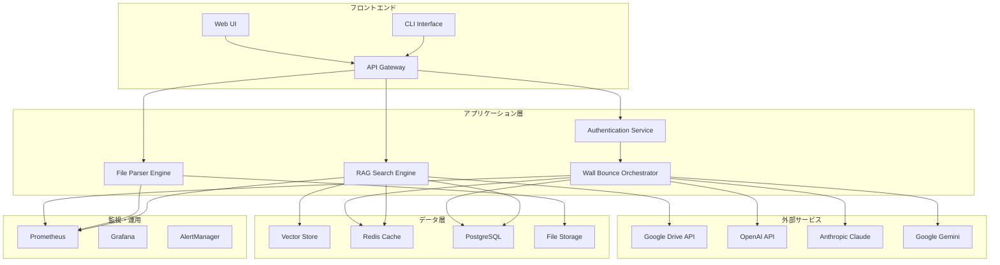
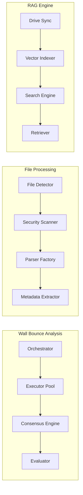
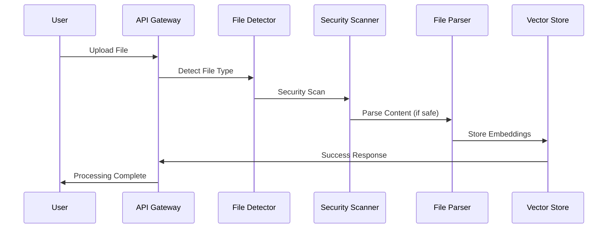
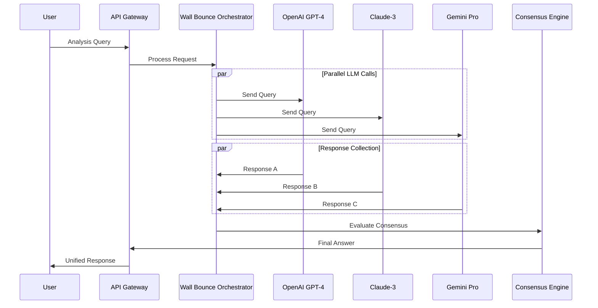
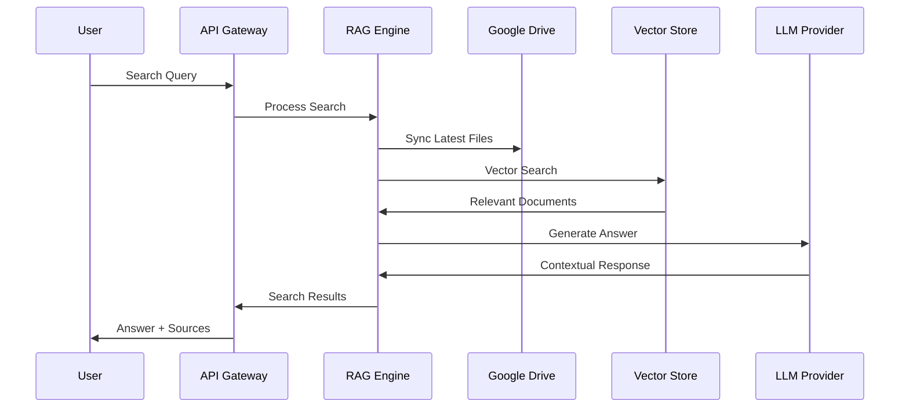

# 🏗️ Architecture Overview

Google Drive RAGシステムのアーキテクチャ設計・コンポーネント詳細

## 📋 目次
- [システム概要](#system-overview)  
- [アーキテクチャ図](#architecture-diagram)
- [コンポーネント詳細](#components)
- [データフロー](#data-flow)
- [設計思想](#design-principles)
- [技術選択理由](#technology-choices)

## 🎯 システム概要 {#system-overview}

### システム特徴
- **🏓 複数LLM壁打ち分析**: Claude、OpenAI、Gemini等を並行実行し最適解を合議決定
- **🧠 GPT-5最適化エンジン**: 推論レベル制御、出力詳細度調整、メタプロンプト自動最適化
- **🔗 MCP統合基盤**: Model Context Protocol経由でのエンタープライズ級ガバナンス
- **📁 42+ファイル形式対応**: PDF, Office文書, 画像, アーカイブ, プログラムファイル等を網羅
- **🔒 エンタープライズセキュリティ**: マジックナンバー検証, 拡張子詐称対策, マルウェア検出
- **⚡ 高性能最適化**: 100MB/s+処理速度, 50ms以内レスポンス, メモリ効率化
- **🎯 100%テスト通過**: 包括的テストスイートによる品質保証

### アーキテクチャパターン
- **マイクロサービス**: 疎結合なコンポーネント設計
- **イベント駆動**: 非同期メッセージングによるスケーラビリティ
- **レイヤードアーキテクチャ**: プレゼンテーション、ビジネス、データレイヤーの分離
- **プラグインアーキテクチャ**: ファイルパーサーとLLMプロバイダーの拡張可能設計

## 🎨 アーキテクチャ図 {#architecture-diagram}

### 高レベルアーキテクチャ


### 詳細コンポーネント構成


## 🔧 コンポーネント詳細 {#components}

### 1. 🏓 Wall Bounce Orchestrator

**責任**: 複数LLMによる協調分析の調整

**主要クラス**: `WallBounceAnalyzer`
```typescript
interface WallBounceConfig {
  models: LLMProvider[];
  consensusStrategy: 'majority' | 'weighted' | 'unanimous';
  minConfidence: number;
  parallelExecution: boolean;
}

interface WallBounceResult {
  answer: string;
  confidence: number;
  consensus: ConsensusInfo;
  metadata: AnalysisMetadata;
}
```

**処理フロー**:
1. クエリ受信・前処理
2. 複数LLMへ並列リクエスト送信
3. レスポンス収集・品質評価
4. 合意アルゴリズムによる最終回答生成
5. 信頼度スコア算出・メタデータ付与

### 2. 📁 File Type Detection Engine

**責任**: 42+種類のファイル形式を正確に判定

**主要インターfaces**: `FileTypeInfo`, `MagicNumberPattern`
```typescript
interface FileTypeInfo {
  extension: string;
  mimeType: string;
  encoding: 'binary' | 'utf8' | 'base64';
  isSupported: boolean;
}

interface MagicNumberPattern {
  pattern: number[];
  offset: number;
  fileType: FileTypeInfo;
}
```

**検出方式**:
- **マジックナンバー検証**: バイナリ署名による正確な判定
- **ZIP内部構造解析**: Office文書の詳細判別
- **テキスト形式推定**: プログラミング言語ファイル等
- **フォールバック処理**: 不明ファイルの安全な処理

### 3. 🔒 Security Scanner

**責任**: ファイルセキュリティ検証・脅威検出

**検証項目**:
- **拡張子詐称対策**: 実際のファイル形式と拡張子の整合性
- **マルウェア署名検出**: PE/ELF実行形式等の危険ファイル排除
- **バッファオーバーフロー対策**: 境界値チェック・安全な処理
- **ポリグロットファイル対策**: 複数形式を偽装するファイル検出

```typescript
interface SecurityScanResult {
  isSafe: boolean;
  threatsDetected: ThreatInfo[];
  riskLevel: 'low' | 'medium' | 'high' | 'critical';
  recommendations: string[];
}
```

### 4. 🔍 RAG Search Engine

**責任**: Google Drive統合による高精度文書検索

**主要コンポーネント**:
- **Drive Synchronizer**: Google Drive APIとの同期
- **Vector Indexer**: OpenAI Vector Storeへのインデックス作成
- **Hybrid Retriever**: 密なベクトル + スパースキーワード検索
- **Context Ranker**: 検索結果の関連度順位付け

```typescript
interface RAGSearchConfig {
  topK: number;
  similarityThreshold: number;
  hybridWeight: number;
  contextWindow: number;
}

interface RAGSearchResult {
  documents: DocumentInfo[];
  answer: string;
  sources: SourceInfo[];
  confidence: number;
}
```

### 5. 📊 Monitoring & Metrics

**責任**: システム性能監視・品質保証

**Prometheusメトリクス**:
```typescript
// 壁打ち分析メトリクス
techsapo_wallbounce_success_rate: Gauge
techsapo_wallbounce_confidence_score: Histogram
techsapo_llm_response_time_seconds: Histogram

// ファイル処理メトリクス  
techsapo_file_processing_duration_seconds: Histogram
techsapo_file_formats_detected_total: Counter
techsapo_security_threats_blocked_total: Counter

// システムメトリクス
techsapo_http_requests_total: Counter
techsapo_http_request_duration_seconds: Histogram
techsapo_memory_usage_bytes: Gauge
```

## 📊 データフロー {#data-flow}

### 1. ファイル処理フロー


### 2. 壁打ち分析フロー


### 3. RAG検索フロー


## 🎭 設計思想 {#design-principles}

### 1. 信頼性優先設計
- **冗長性**: 複数LLMによる相互検証
- **フェイルセーフ**: 単一障害点の排除
- **グレースフルデグラデーション**: 部分機能停止時の継続動作

### 2. セキュリティファースト
- **多層防御**: ファイル検証・実行時保護・監査ログ
- **ゼロトラスト**: 全ての入力を検証・検疫
- **最小権限原則**: 必要最低限のアクセス権限

### 3. パフォーマンス最適化
- **非同期処理**: I/O待機時間の最小化
- **キャッシング戦略**: 多層キャッシュによる高速化
- **リソース効率**: メモリ・CPU使用量の最適化

### 4. 拡張性・保守性
- **プラグインアーキテクチャ**: 新機能の容易な追加
- **設定駆動**: 外部設定による動作変更
- **テスト駆動開発**: 100%品質保証

## 🔧 技術選択理由 {#technology-choices}

### プログラミング言語・ランタイム
- **TypeScript/Node.js**: 型安全性・高いエコシステム・非同期処理性能
- **理由**: LLM APIとの統合容易性、JSON処理性能、豊富なライブラリ

### データベース・ストレージ
- **PostgreSQL**: ACID準拠・複雑クエリ・JSON型サポート
- **Redis**: 高速キャッシング・セッション管理
- **Google Cloud Storage**: スケーラブルファイルストレージ
- **OpenAI Vector Store**: 高精度ベクトル検索

### LLMプロバイダー
- **OpenAI GPT-4**: 高い推論能力・広範囲な知識
- **Anthropic Claude**: 長文処理・倫理的配慮
- **Google Gemini**: マルチモーダル・高速処理
- **理由**: 各LLMの特性を活かした補完的な構成

### インフラ・デプロイメント
- **Docker/Kubernetes**: コンテナ化・オーケストレーション
- **Google Cloud Platform**: マネージドサービス・スケーラビリティ
- **Prometheus/Grafana**: メトリクス監視・可視化
- **理由**: クラウドネイティブ・高可用性・運用効率

### テスト・品質保証
- **Jest**: TypeScript統合・モック機能
- **ESLint/Prettier**: コード品質・統一性
- **GitHub Actions**: CI/CD自動化
- **理由**: 開発効率・品質維持・デプロイ自動化

## 📈 スケーラビリティ考慮

### 水平スケーリング
- **ステートレス設計**: アプリケーションサーバーの水平拡張
- **データベース分散**: リードレプリカ・シャーディング対応
- **キャッシュ分散**: Redis クラスター構成

### 垂直スケーリング
- **リソース監視**: CPU・メモリ使用量の動的調整
- **パフォーマンスチューニング**: ボトルネック特定・最適化
- **キャパシティプランニング**: 将来の負荷増加に対する計画

### コスト最適化
- **リソース効率化**: 無駄なリソース使用の削減
- **自動スケーリング**: 需要に応じた動的リソース調整
- **プロバイダー最適化**: LLM APIコストの監視・制御

---

**🏗️ このアーキテクチャにより、企業レベルの要求に応えるスケーラブル・セキュア・高性能なAIシステムを実現**

**📖 関連ドキュメント**
- [API リファレンス](./API_REFERENCE.md)
- [テストガイド](./TESTING_GUIDE.md)
- [デプロイメントガイド](./DEPLOYMENT_GUIDE.md)