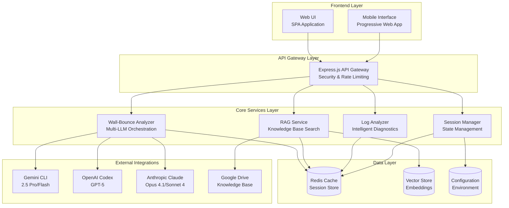
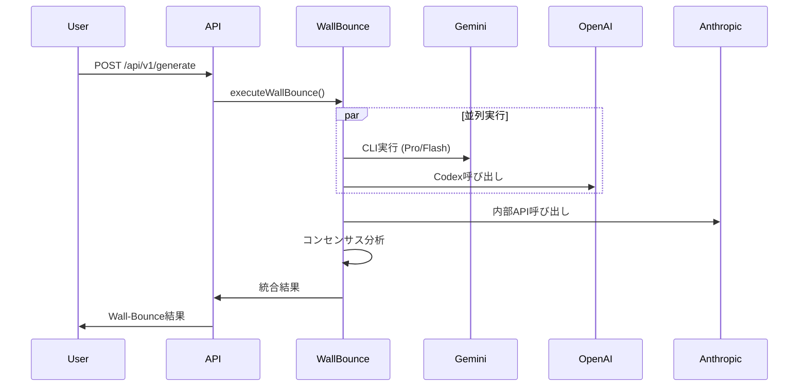
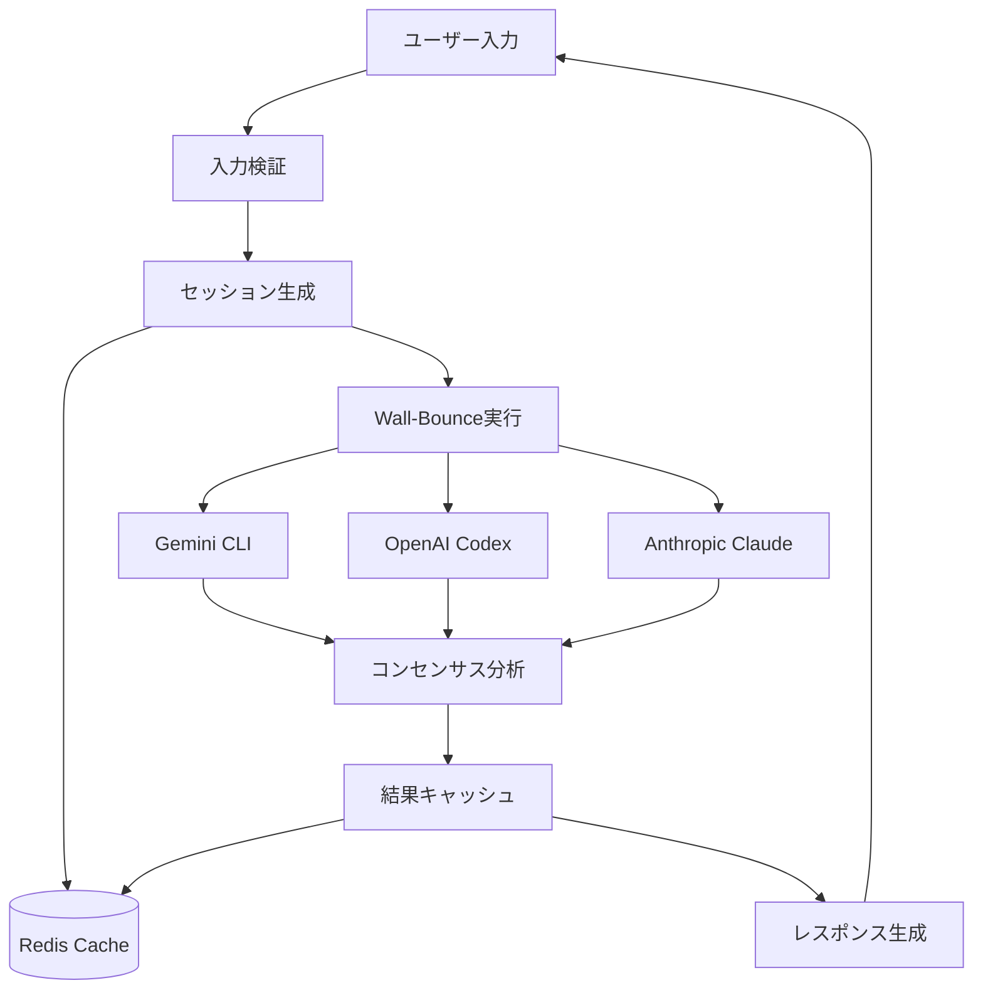

# TechSapo 基本設計書

## 1. システム概要

### 1.1 システム目的
TechSapoは、複数のLLM（Large Language Model）を活用した「Wall-Bounce」技術により、高品質で信頼性の高いIT技術サポートを提供する次世代プラットフォームです。

### 1.2 システムの特徴
- **マルチLLM Wall-Bounce分析**: 複数のAIモデルによる相互検証システム
- **インテリジェントログ解析**: AI駆動による自動問題診断
- **RAG知識ベース**: Google Drive統合によるナレッジ管理
- **リアルタイム監視**: Server-Sent Eventsによる即座な状態把握

### 1.3 対象ユーザー
- IT技術者・エンジニア
- システム管理者
- 技術サポート担当者
- 開発チーム

## 2. システム全体構成

### 2.1 システム構成図



### 2.2 技術スタック

#### フロントエンド
- **Base**: Vanilla JavaScript (ES2022)
- **UI Framework**: Semantic HTML5 + CSS3
- **Icons**: Font Awesome 6.4.0
- **Fonts**: Noto Sans JP
- **Protocol**: Server-Sent Events (SSE)

#### バックエンド
- **Runtime**: Node.js 18+ with TypeScript
- **Framework**: Express.js 4.x
- **Language**: TypeScript (ES2022, CommonJS)
- **Security**: Helmet.js, CORS
- **Cache**: Redis 7.x
- **Process Management**: PM2

#### 外部統合
- **LLM Providers**: 
  - Gemini CLI (2.5 Pro/Flash)
  - OpenAI Codex (GPT-5)
  - Anthropic Claude (Opus 4.1/Sonnet 4)
- **Knowledge Base**: Google Drive API v3
- **Embedding**: OpenAI text-embedding-3-large
- **Vector Store**: OpenAI Vector Store

## 3. アーキテクチャ設計原則

### 3.1 設計原則

#### 3.1.1 Wall-Bounce必須原則
```
物事の解決には2以上のLLMモデルとの壁うち必須
```
- 最低2つのLLMプロバイダーでコンセンサス形成
- 3回以上の壁打ち分析実施
- 異なるベンダーのLLMを順次活用

#### 3.1.2 プロバイダー制約
- **OpenAI**: 必ずCodex経由で呼び出し（直接API使用禁止）
- **Anthropic**: Claude Code直接呼び出しのみ（API使用絶対禁止）
- **Google**: Gemini CLI経由のみ（API_KEY使用禁止）

#### 3.1.3 品質保証
- Confidence ≥ 0.7（信頼度閾値）
- Consensus ≥ 0.6（合意スコア閾値）
- 処理タイムアウト: 設定ベース制御

### 3.2 アーキテクチャパターン

#### 3.2.1 レイヤードアーキテクチャ
```
┌─────────────────────────────┐
│    Presentation Layer       │ ← UI/API
├─────────────────────────────┤
│    Application Layer        │ ← Business Logic
├─────────────────────────────┤
│    Domain Layer             │ ← Core Models
├─────────────────────────────┤
│    Infrastructure Layer     │ ← External Services
└─────────────────────────────┘
```

#### 3.2.2 マイクロサービス指向
- 独立したサービス境界
- API-Firstアプローチ
- 責務の明確な分離
- 疎結合・高凝集

## 4. 機能設計

### 4.1 主要機能一覧

| 機能名 | 機能概要 | 優先度 |
|--------|----------|--------|
| Wall-Bounce分析 | マルチLLMによる相互検証分析 | 最高 |
| ログ解析 | AIによる自動問題診断 | 高 |
| RAG検索 | 知識ベース検索・回答生成 | 高 |
| セッション管理 | ユーザー状態・履歴管理 | 中 |
| リアルタイム監視 | システム状態・メトリクス監視 | 中 |
| 手動同期 | Google Drive知識ベース同期 | 低 |

### 4.2 Wall-Bounce分析機能

#### 4.2.1 機能概要
複数のLLMプロバイダーを並列・順次実行し、回答品質を相互検証する核心機能。

#### 4.2.2 処理フロー


#### 4.2.3 品質保証メカニズム
- **信頼度計算**: 複数回答の一貫性評価
- **合意スコア**: プロバイダー間合意度測定
- **コスト最適化**: トークン数管理・費用追跡

### 4.3 ログ解析機能

#### 4.3.1 機能概要
エラーログとシステム情報を入力として、AI分析による問題診断と解決策提示を行う。

#### 4.3.2 分析カテゴリ
- **dependency**: 依存関係問題
- **configuration**: 設定問題
- **network**: ネットワーク問題
- **permission**: 権限問題
- **resource**: リソース問題
- **unknown**: 未分類問題

#### 4.3.3 出力情報
- 問題特定・根本原因分析
- 段階的解決手順
- 重要度評価（low/medium/high）
- 予防策・追加確認事項

### 4.4 RAG検索機能

#### 4.4.1 機能概要
Google Drive上の技術ドキュメントをベクトル化し、自然言語クエリによる高精度検索を実現。

#### 4.4.2 技術構成
- **Embedding Model**: text-embedding-3-large
- **Vector Store**: OpenAI Vector Store
- **Metadata管理**: ファイル情報・更新日時
- **同期機能**: 手動・自動ドキュメント同期

## 5. データ設計

### 5.1 データフロー図



### 5.2 Redis データ構造

#### 5.2.1 セッション管理
```
sessions:{sessionId}
├── user_id: string
├── created_at: timestamp  
├── last_accessed: timestamp
├── session_data: JSON
└── expires_at: timestamp
```

#### 5.2.2 キャッシュ管理
```
cache:wall_bounce:{hash}
├── prompt_hash: string
├── result: JSON
├── confidence: number
├── created_at: timestamp
└── expires_at: timestamp
```

#### 5.2.3 メトリクス管理
```
metrics:realtime
├── requests_count: number
├── active_sessions: number
├── response_time_avg: number
├── wall_bounce_success_rate: number
└── timestamp: timestamp
```

### 5.3 設定管理

#### 5.3.1 環境変数構成
```typescript
interface EnvironmentConfig {
  server: {
    port: number;           // サーバーポート
    nodeEnv: string;        // 実行環境
  };
  
  wallBounce: {
    enableFallback: boolean;    // フォールバック有効化
    enableTimeout: boolean;     // タイムアウト有効化
    timeoutMs: number;          // タイムアウト時間
    minProviders: number;       // 最小プロバイダー数
  };
  
  redis: {
    host: string;
    port: number;
    password?: string;
    db: number;
  };
}
```

## 6. セキュリティ設計

### 6.1 セキュリティ要件

#### 6.1.1 認証・認可
- セッションベース認証
- JWTトークン（将来実装）
- ロールベースアクセス制御

#### 6.1.2 データ保護
- TLS/HTTPS通信
- 機密情報マスキング
- ログ出力時のAPI_KEY除去

#### 6.1.3 入力検証
- リクエストパラメータ検証
- SQLインジェクション対策
- XSS攻撃対策

### 6.2 API Key管理戦略

#### 6.2.1 プロバイダー別戦略
```typescript
// Gemini: CLI専用（API_KEY使用禁止）
const geminiExecution = spawn('gemini', args, {
  env: { ...process.env }  // API_KEY除去済み
});

// OpenAI: Codex経由専用（直接API禁止）
const openaiResponse = await codexProvider.execute(prompt);

// Anthropic: 内部API専用
const anthropicResponse = await internalClaudeAPI(prompt);
```

### 6.3 レート制限・スロットリング

| エンドポイント | 制限値 | 時間窓 |
|--------------|-------|--------|
| /api/v1/generate | 10回/分 | IP単位 |
| /api/v1/analyze-logs | 20回/分 | IP単位 |
| /api/v1/rag/search | 30回/分 | IP単位 |

## 7. パフォーマンス設計

### 7.1 性能要件

| 項目 | 目標値 | 測定方法 |
|------|--------|----------|
| Wall-Bounce応答時間 | < 60秒 | API レスポンス測定 |
| ログ分析応答時間 | < 30秒 | API レスポンス測定 |
| RAG検索応答時間 | < 10秒 | API レスポンス測定 |
| 同時接続数 | 100接続 | 負荷テスト |
| キャッシュヒット率 | > 80% | Redis監視 |

### 7.2 最適化戦略

#### 7.2.1 並列処理
- Wall-Bounce: 複数Provider同時実行
- RAG検索: 埋め込み生成と検索の並列化
- キャッシュ: 非同期書き込み

#### 7.2.2 キャッシュ戦略
```typescript
// 階層キャッシュ構成
const cacheConfig = {
  wall_bounce_results: { ttl: 300 },    // 5分
  rag_embeddings: { ttl: 86400 },       // 24時間
  session_data: { ttl: 1800 },          // 30分
  metrics: { ttl: 60 }                  // 1分
};
```

### 7.3 スケーラビリティ設計

#### 7.3.1 水平スケーリング準備
- ステートレスサービス設計
- Redis外部化
- Load Balancer対応

#### 7.3.2 リソース管理
```bash
# Node.js最適化
NODE_OPTIONS='--max-old-space-size=1024 --expose-gc'

# PM2クラスター構成
pm2 start ecosystem.config.js --env production
```

## 8. 運用・監視設計

### 8.1 ロギング戦略

#### 8.1.1 ログレベル
- **INFO**: 正常処理フロー
- **WARN**: 注意が必要な状況
- **ERROR**: エラー・例外

#### 8.1.2 構造化ログ
```typescript
interface LogEntry {
  level: 'info' | 'warn' | 'error';
  service: string;
  message: string;
  timestamp: string;
  metadata?: {
    user_id?: string;
    session_id?: string;
    request_id?: string;
    duration_ms?: number;
  };
}
```

### 8.2 メトリクス監視

#### 8.2.1 ビジネスメトリクス
- Wall-Bounce実行回数・成功率
- プロバイダー別レスポンス時間
- ユーザーセッション数
- API呼び出し頻度

#### 8.2.2 システムメトリクス
- CPU・メモリ使用率
- Redis接続数・レスポンス時間
- ネットワークI/O
- ディスク使用量

### 8.3 ヘルスチェック

#### 8.3.1 多段階ヘルスチェック
```typescript
interface HealthCheck {
  shallow: '/health';           // 基本生存確認
  deep: '/api/v1/health';      // 依存サービス確認
  metrics: '/api/v1/metrics/stream';  // リアルタイム監視
}
```

## 9. テスト戦略

### 9.1 テスト分類

#### 9.1.1 テストピラミッド
```
    ┌─────────────┐
    │   E2E Tests │ ← ブラウザ自動化
    ├─────────────┤
    │   API Tests │ ← API統合テスト
    ├─────────────┤
    │  Unit Tests │ ← 単体テスト
    └─────────────┘
```

#### 9.1.2 テスト観点
- **機能テスト**: Wall-Bounce動作確認
- **性能テスト**: レスポンス時間・同時接続
- **セキュリティテスト**: 入力検証・認証
- **統合テスト**: 外部サービス連携

### 9.2 テスト環境

#### 9.2.1 環境構成
- **開発環境**: モックサービス利用
- **ステージング環境**: 本番同等構成
- **本番環境**: 実際のサービス

#### 9.2.2 CI/CD統合
```yaml
# GitHub Actions例
test:
  - npm run test:unit
  - npm run test:integration
  - npm run test:e2e
  - npm run lint
  - npm run build
```

## 10. 今後の発展計画

### 10.1 短期計画（3ヶ月）
- 認証・認可機能実装
- モバイル対応強化
- パフォーマンス最適化

### 10.2 中期計画（6ヶ月）
- マイクロサービス分割
- Kubernetes対応
- 高可用性構成

### 10.3 長期計画（12ヶ月）
- AI/ML機能拡張
- 多言語対応
- エンタープライズ機能

## 付録

### A. 技術選定理由

| 技術 | 選定理由 |
|------|----------|
| TypeScript | 型安全性・開発効率向上 |
| Express.js | 成熟したエコシステム・軽量 |
| Redis | 高速キャッシュ・セッション管理 |
| Jest | 豊富な機能・モック対応 |

### B. 用語集

| 用語 | 定義 |
|------|------|
| Wall-Bounce | 複数LLMによる相互検証技術 |
| RAG | Retrieval-Augmented Generation |
| Vector Store | ベクトル化文書ストレージ |
| SSE | Server-Sent Events |

---

**作成日**: 2025-09-27  
**バージョン**: 1.0  
**承認者**: TechSapo開発チーム