# TechSapo 基本設計書 - 詳細版

<div style="page-break-after: always;"></div>

## 📋 目次

1. [システム概要](#1-システム概要)
2. [システム全体構成](#2-システム全体構成)
3. [アーキテクチャ設計原則](#3-アーキテクチャ設計原則)
4. [機能設計](#4-機能設計)
5. [データ設計](#5-データ設計)
6. [セキュリティ設計](#6-セキュリティ設計)
7. [パフォーマンス設計](#7-パフォーマンス設計)
8. [運用・監視設計](#8-運用監視設計)
9. [テスト戦略](#9-テスト戦略)
10. [今後の発展計画](#10-今後の発展計画)

<div style="page-break-after: always;"></div>

## 1. システム概要

### 1.1 システム目的

TechSapoは、複数のLLM（Large Language Model）を活用した**「Wall-Bounce」技術**により、高品質で信頼性の高いIT技術サポートを提供する次世代プラットフォームです。

```mermaid
graph LR
    A[ユーザーの技術的課題] --> B[TechSapo Platform]
    B --> C[AI分析・解決策提示]
    C --> D[高品質な解決策]
    
    B --> E[Wall-Bounce分析]
    B --> F[RAG知識ベース]
    B --> G[ログ分析エンジン]
    
    style A fill:#e1f5fe
    style D fill:#c8e6c9
    style B fill:#fff3e0
```

### 1.2 システムの特徴

#### 🏓 Core Features Overview

```mermaid
mindmap
  root((TechSapo Core))
    Wall-Bounce分析
      複数LLMオーケストレーション
      コンセンサス形成
      品質保証メカニズム
    知識ベース統合
      Google Drive RAG
      Vector Search
      リアルタイム同期
    監視・運用
      Prometheus Metrics
      Grafana Dashboard
      アラート機能
    セキュリティ
      API Key管理
      レート制限
      暗号化通信
```

### 1.3 対象ユーザー

| ユーザー種別 | 利用シーナリオ | 主要機能 |
|-------------|--------------|---------|
| **IT技術者・エンジニア** | 技術的問題解決、設計レビュー | Wall-Bounce分析、RAG検索 |
| **システム管理者** | 障害対応、ログ解析 | ログ分析、リアルタイム監視 |
| **技術サポート担当者** | ユーザーサポート、FAQ対応 | 知識ベース検索、セッション管理 |
| **開発チーム** | コードレビュー、技術調査 | Wall-Bounce分析、API統合 |

### 1.4 システム価値提案

```mermaid
graph TD
    A[従来の問題] --> A1[単一AIモデルの限界]
    A --> A2[知識の分散・断片化]
    A --> A3[手動分析の時間コスト]
    
    B[TechSapoによる解決] --> B1[複数AIモデル協調]
    B --> B2[統合知識ベース]
    B --> B3[自動化・効率化]
    
    B1 --> C[高品質・高信頼性]
    B2 --> C
    B3 --> C
    
    style A fill:#ffcdd2
    style B fill:#c8e6c9
    style C fill:#fff3e0
```

<div style="page-break-after: always;"></div>

## 2. システム全体構成

### 2.1 システム構成図

```mermaid
graph TB
    subgraph "Frontend Layer"
        UI[Web UI<br/>SPA Application<br/>🖥️ HTML5 + JS]
        Mobile[Mobile Interface<br/>Progressive Web App<br/>📱 PWA]
    end

    subgraph "API Gateway Layer"
        Gateway[Express.js API Gateway<br/>🛡️ Security & Rate Limiting<br/>📊 Request/Response Logging]
    end

    subgraph "Core Services Layer"
        WB[Wall-Bounce Analyzer<br/>🤖 Multi-LLM Orchestration<br/>⚖️ Consensus Engine]
        RAG[RAG Service<br/>📚 Knowledge Base Search<br/>🔍 Vector Similarity]
        LOG[Log Analyzer<br/>🔧 Intelligent Diagnostics<br/>📈 Pattern Recognition]
        SESSION[Session Manager<br/>💾 State Management<br/>🕒 Lifecycle Control]
    end

    subgraph "Data Layer"
        Redis[(Redis Cache<br/>⚡ Session Store<br/>🔄 Real-time Data)]
        Vector[(Vector Store<br/>📄 Document Embeddings<br/>🧠 Semantic Search)]
        Config[(Configuration<br/>⚙️ Environment Vars<br/>🔒 Secure Storage)]
    end

    subgraph "External Integrations"
        Gemini[Gemini CLI<br/>🟢 2.5 Pro/Flash<br/>📊 Cost: $0.002/1K]
        OpenAI[OpenAI Codex<br/>🔵 GPT-5<br/>💰 Cost: $0.03/1K]
        Anthropic[Anthropic Claude<br/>🟣 Opus 4.1/Sonnet 4<br/>💎 Premium Tier]
        Drive[Google Drive<br/>☁️ Knowledge Base<br/>📁 Document Storage]
    end

    UI --> Gateway
    Mobile --> Gateway
    Gateway --> WB
    Gateway --> RAG
    Gateway --> LOG
    Gateway --> SESSION

    WB --> Redis
    RAG --> Redis
    LOG --> Redis
    SESSION --> Redis

    RAG --> Vector
    SESSION --> Config

    WB --> Gemini
    WB --> OpenAI
    WB --> Anthropic
    RAG --> Drive

    style UI fill:#e3f2fd
    style Mobile fill:#e3f2fd
    style Gateway fill:#fff3e0
    style WB fill:#f3e5f5
    style RAG fill:#e8f5e8
    style LOG fill:#fff8e1
    style SESSION fill:#fce4ec
```

### 2.2 技術スタック詳細

#### Frontend技術構成


#### Backend技術構成


### 2.3 ネットワーク構成図


<div style="page-break-after: always;"></div>

## 3. アーキテクチャ設計原則

### 3.1 Wall-Bounce必須原則

```mermaid
flowchart TD
    A[ユーザークエリ] --> B{2以上のLLMモデル<br/>利用可能？}
    B -->|No| C[エラー: 最小要件未満]
    B -->|Yes| D[Wall-Bounce開始]
    
    D --> E[LLM Provider 1]
    D --> F[LLM Provider 2] 
    D --> G[LLM Provider 3<br/>オプション]
    
    E --> H[Response 1]
    F --> I[Response 2]
    G --> J[Response 3]
    
    H --> K[Consensus Analysis]
    I --> K
    J --> K
    
    K --> L{Confidence ≥ 0.7<br/>AND<br/>Consensus ≥ 0.6?}
    L -->|No| M[追加Provider呼び出し]
    L -->|Yes| N[統合レスポンス生成]
    
    M --> O[Provider 4]
    O --> P[Response 4]
    P --> K
    
    N --> Q[ユーザーへ返答]
    
    style A fill:#e1f5fe
    style N fill:#c8e6c9
    style Q fill:#c8e6c9
    style C fill:#ffcdd2
```

### 3.2 プロバイダー制約・ガードレール

```mermaid
graph TB
    subgraph "Provider Constraints"
        A[OpenAI] --> A1[❌ 直接API使用禁止]
        A --> A2[✅ Codex経由のみ]
        A --> A3[💰 コスト: $0.03/1K tokens]
        
        B[Anthropic] --> B1[❌ API_KEY使用禁止]
        B --> B2[✅ Claude Code直接のみ]
        B --> B3[💎 Premium Tier]
        
        C[Google] --> C1[❌ API_KEY使用禁止]
        C --> C2[✅ Gemini CLI経由のみ]
        C --> C3[💚 コスト効率最高]
    end
    
    subgraph "Quality Gates"
        D[Confidence Threshold] --> D1[≥ 0.7 必須]
        E[Consensus Threshold] --> E1[≥ 0.6 必須]
        F[Timeout Control] --> F1[設定ベース制御]
    end
    
    style A1 fill:#ffcdd2
    style B1 fill:#ffcdd2
    style C1 fill:#ffcdd2
    style A2 fill:#c8e6c9
    style B2 fill:#c8e6c9
    style C2 fill:#c8e6c9
```

### 3.3 アーキテクチャパターン

#### レイヤードアーキテクチャ

```mermaid
graph TB
    subgraph "Layered Architecture"
        P[Presentation Layer<br/>🖥️ UI/API Endpoints]
        A[Application Layer<br/>🔧 Business Logic & Orchestration]
        D[Domain Layer<br/>📋 Core Models & Rules]
        I[Infrastructure Layer<br/>🔌 External Services & Data]
    end
    
    P --> A
    A --> D
    D --> I
    
    subgraph "Cross-Cutting Concerns"
        S[Security<br/>🛡️ Authentication & Authorization]
        L[Logging<br/>📝 Structured Logging]
        M[Monitoring<br/>📊 Metrics & Health Checks]
        C[Caching<br/>⚡ Redis-based Performance]
    end
    
    S -.-> P
    S -.-> A
    L -.-> P
    L -.-> A
    L -.-> D
    L -.-> I
    M -.-> P
    M -.-> A
    C -.-> A
    C -.-> I
```

#### マイクロサービス指向設計

```mermaid
graph LR
    subgraph "Service Boundaries"
        WBS[Wall-Bounce Service<br/>🤖 独立したLLMオーケストレーション]
        RAGS[RAG Service<br/>📚 知識ベース管理]
        LOGS[Log Analysis Service<br/>🔍 ログ解析専門]
        SESS[Session Service<br/>👤 ユーザー状態管理]
    end
    
    subgraph "API-First Design"
        API[Unified API Gateway<br/>📡 統一インターフェース]
    end
    
    subgraph "Shared Infrastructure"
        CACHE[Redis Cache<br/>⚡ 共有キャッシュ]
        LOG[Central Logging<br/>📝 集約ログ]
        MON[Monitoring<br/>📊 統合監視]
    end
    
    API --> WBS
    API --> RAGS
    API --> LOGS
    API --> SESS
    
    WBS --> CACHE
    RAGS --> CACHE
    LOGS --> CACHE
    SESS --> CACHE
    
    WBS --> LOG
    RAGS --> LOG
    LOGS --> LOG
    SESS --> LOG
    
    WBS --> MON
    RAGS --> MON
    LOGS --> MON
    SESS --> MON
```

<div style="page-break-after: always;"></div>

## 4. 機能設計

### 4.1 主要機能マップ

```mermaid
mindmap
  root((TechSapo 機能))
    Wall-Bounce分析
      並列実行モード
        複数Provider同時実行
        レスポンス統合
      順次実行モード
        順番実行
        品質向上
      コンセンサス分析
        信頼度計算
        合意スコア算出
      品質保証
        閾値チェック
        フォールバック
    ログ解析
      パターン認識
        dependency
        configuration
        network
        permission
        resource
      解決策提示
        段階的手順
        重要度評価
        予防策
    RAG検索
      Vector Search
        埋め込み生成
        類似度計算
      ドキュメント管理
        Google Drive同期
        メタデータ管理
      検索最適化
        クエリ最適化
        結果ランキング
    セッション管理
      状態管理
        Redis backed
        TTL制御
      履歴管理
        会話履歴
        分析履歴
      ユーザー管理
        識別子管理
        設定保持
```

### 4.2 Wall-Bounce分析機能詳細

#### 処理フロー図

```mermaid
sequenceDiagram
    participant User as 👤 User
    participant API as 🌐 API Gateway
    participant WB as 🤖 Wall-Bounce Analyzer
    participant G as 🟢 Gemini CLI
    participant O as 🔵 OpenAI Codex
    participant A as 🟣 Anthropic Claude
    participant R as ⚡ Redis Cache

    User->>API: POST /api/v1/generate
    Note over User,API: プロンプト + オプション
    
    API->>API: 入力検証 & レート制限チェック
    API->>WB: executeWallBounce(prompt, options)
    
    WB->>R: キャッシュ確認
    alt キャッシュヒット
        R-->>WB: cached result
        WB-->>API: return cached response
    else キャッシュミス
        
        par 並列実行 (Parallel Mode)
            WB->>G: CLI実行 (Pro/Flash)
            WB->>O: Codex呼び出し
        end
        
        WB->>A: 内部API呼び出し
        
        G-->>WB: Response 1 (confidence: 0.85)
        O-->>WB: Response 2 (confidence: 0.92)
        A-->>WB: Response 3 (confidence: 0.88)
        
        WB->>WB: コンセンサス分析
        Note over WB: 信頼度: 0.88, 合意: 0.91
        
        alt 品質閾値OK
            WB->>WB: 統合レスポンス生成
            WB->>R: 結果キャッシュ (TTL: 300s)
            WB-->>API: Wall-Bounce結果
        else 品質閾値NG
            WB->>WB: 追加Provider実行
            Note over WB: Provider 4を呼び出し
        end
    end
    
    API-->>User: 統合された高品質回答
```

#### コンセンサス分析アルゴリズム

```mermaid
flowchart TD
    A[複数LLMレスポンス] --> B[レスポンス解析]
    B --> C[キーワード抽出]
    B --> D[セマンティック類似度]
    B --> E[構造的類似度]
    
    C --> F[重複度計算]
    D --> G[意味的合意度]
    E --> H[形式的一貫性]
    
    F --> I[統合スコア算出]
    G --> I
    H --> I
    
    I --> J{スコア ≥ 0.6？}
    J -->|Yes| K[高品質統合レスポンス]
    J -->|No| L[追加Provider実行]
    
    L --> M[Provider 4]
    M --> N[新しいレスポンス]
    N --> B
    
    style K fill:#c8e6c9
    style L fill:#fff3e0
```

### 4.3 ログ分析機能詳細

#### 分析パイプライン

```mermaid
flowchart LR
    subgraph "入力処理"
        A[ユーザーコマンド] --> B[エラー出力]
        B --> C[システムコンテキスト]
    end
    
    subgraph "前処理"
        C --> D[ログ正規化]
        D --> E[パターン抽出]
        E --> F[キーワード特定]
    end
    
    subgraph "AI分析"
        F --> G[Wall-Bounce分析]
        G --> H[問題カテゴリ分類]
        H --> I[根本原因特定]
    end
    
    subgraph "解決策生成"
        I --> J[段階的手順作成]
        J --> K[重要度評価]
        K --> L[予防策提示]
    end
    
    subgraph "出力"
        L --> M[構造化レスポンス]
        M --> N[アクション可能な手順]
    end
```

#### 問題分類マトリクス

```mermaid
graph TB
    subgraph "Problem Categories"
        A[dependency<br/>依存関係問題<br/>📦]
        B[configuration<br/>設定問題<br/>⚙️]
        C[network<br/>ネットワーク問題<br/>🌐]
        D[permission<br/>権限問題<br/>🔒]
        E[resource<br/>リソース問題<br/>💾]
        F[unknown<br/>未分類問題<br/>❓]
    end
    
    subgraph "Severity Levels"
        S1[Low<br/>軽微<br/>🟢]
        S2[Medium<br/>中程度<br/>🟡]
        S3[High<br/>重大<br/>🔴]
    end
    
    subgraph "Resolution Time"
        T1[< 30分<br/>即座対応]
        T2[30分-2時間<br/>短期対応]
        T3[> 2時間<br/>長期対応]
    end
    
    A --> S1
    A --> S2
    B --> S2
    B --> S3
    C --> S1
    C --> S3
    D --> S2
    D --> S3
    E --> S3
    F --> S1
    F --> S2
    F --> S3
```

### 4.4 RAG検索機能詳細

#### ベクトル検索パイプライン

```mermaid
flowchart TD
    subgraph "クエリ処理"
        A[自然言語クエリ] --> B[クエリ正規化]
        B --> C[キーワード拡張]
        C --> D[埋め込み生成]
    end
    
    subgraph "ドキュメント管理"
        E[Google Drive] --> F[ドキュメント同期]
        F --> G[テキスト抽出]
        G --> H[チャンク分割]
        H --> I[埋め込み生成]
        I --> J[Vector Store保存]
    end
    
    subgraph "検索実行"
        D --> K[類似度計算]
        K --> L[Vector Store検索]
        L --> M[結果ランキング]
    end
    
    subgraph "結果処理"
        M --> N[メタデータ付加]
        N --> O[コンテキスト拡張]
        O --> P[レスポンス生成]
    end
    
    J --> L
```

#### ドキュメント同期フロー

```mermaid
sequenceDiagram
    participant GD as ☁️ Google Drive
    participant WH as 🔔 Webhook Handler  
    participant RAG as 📚 RAG Connector
    participant VS as 🧠 Vector Store
    participant R as ⚡ Redis

    Note over GD,R: 自動同期フロー
    
    GD->>WH: ファイル変更通知
    WH->>WH: 変更タイプ判定
    
    alt ファイル追加/更新
        WH->>RAG: syncDocument(fileId)
        RAG->>GD: ファイル取得
        RAG->>RAG: テキスト抽出 & チャンク分割
        RAG->>VS: 埋め込み生成 & 保存
        RAG->>R: メタデータキャッシュ
    else ファイル削除
        WH->>VS: deleteDocument(fileId)
        WH->>R: キャッシュクリア
    end
    
    RAG-->>WH: 同期完了
    WH-->>GD: ACK
    
    Note over GD,R: 手動同期フロー
    
    participant U as 👤 User
    U->>RAG: POST /api/v1/rag/sync
    RAG->>GD: フォルダー一覧取得
    
    loop 各ファイル
        RAG->>GD: ファイル内容取得
        RAG->>VS: 埋め込み更新
        RAG->>R: メタデータ更新
    end
    
    RAG-->>U: 同期レポート
```

<div style="page-break-after: always;"></div>

## 5. データ設計

### 5.1 データフロー概要

```mermaid
flowchart LR
    subgraph "Input Sources"
        UI[Web UI<br/>👤 User Input]
        API[API Clients<br/>🔌 External Apps]
        WH[Webhooks<br/>🔔 External Events]
    end
    
    subgraph "Processing Layer"
        VAL[Input Validation<br/>✅ Schema Check]
        AUTH[Authentication<br/>🔐 Security Layer]
        RATE[Rate Limiting<br/>🚦 Traffic Control]
    end
    
    subgraph "Business Logic"
        WB[Wall-Bounce<br/>🤖 AI Processing]
        RAG[RAG Search<br/>📚 Knowledge Retrieval] 
        LOG[Log Analysis<br/>🔍 Problem Diagnosis]
        SESS[Session Mgmt<br/>👤 State Management]
    end
    
    subgraph "Data Storage"
        REDIS[(Redis<br/>⚡ Cache & Sessions)]
        VECTOR[(Vector Store<br/>🧠 Embeddings)]
        CONFIG[(Config Store<br/>⚙️ Environment)]
    end
    
    subgraph "External APIs"
        GEMINI[Gemini CLI<br/>🟢 Google AI]
        OPENAI[OpenAI Codex<br/>🔵 GPT Models]
        CLAUDE[Claude API<br/>🟣 Anthropic]
        DRIVE[Google Drive<br/>☁️ Documents]
    end
    
    UI --> VAL
    API --> VAL
    WH --> VAL
    
    VAL --> AUTH
    AUTH --> RATE
    
    RATE --> WB
    RATE --> RAG
    RATE --> LOG
    RATE --> SESS
    
    WB --> REDIS
    RAG --> REDIS
    LOG --> REDIS
    SESS --> REDIS
    
    RAG --> VECTOR
    SESS --> CONFIG
    
    WB --> GEMINI
    WB --> OPENAI
    WB --> CLAUDE
    RAG --> DRIVE
```

### 5.2 Redis データ構造詳細

#### セッション管理スキーマ


#### キャッシュ管理スキーマ

```mermaid
erDiagram
    WALL_BOUNCE_CACHE {
        string prompt_hash PK
        json result
        number confidence
        number consensus_score
        array providers_used
        timestamp created_at
        timestamp expires_at
        number access_count
    }
    
    RAG_CACHE {
        string query_hash PK
        json search_results
        array document_ids
        number total_documents
        timestamp created_at
        timestamp expires_at
        string embedding_model
    }
    
    CONTEXT7_CACHE {
        string library_key PK
        json documentation
        string version
        timestamp created_at
        timestamp expires_at
        number tokens_used
    }
    
    METRICS_CACHE {
        string metric_key PK
        json realtime_data
        timestamp updated_at
        number requests_count
        number active_sessions
        number response_time_avg
    }
```

#### Vector Store マッピング

```mermaid
erDiagram
    DRIVE_VECTOR_MAPPING {
        string drive_file_id PK
        string vector_store_file_id UK
        string file_name
        number file_size
        string file_type
        timestamp created_at
        timestamp updated_at
        string folder_path
        json metadata
    }
    
    DOCUMENT_CHUNKS {
        string chunk_id PK
        string drive_file_id FK
        string content
        number chunk_index
        array embedding_vector
        json chunk_metadata
        timestamp created_at
    }
    
    SEARCH_INDEX {
        string keyword PK
        array document_ids
        array chunk_ids
        number frequency
        timestamp last_updated
    }
    
    DRIVE_VECTOR_MAPPING ||--o{ DOCUMENT_CHUNKS : "contains"
    DOCUMENT_CHUNKS }o--|| SEARCH_INDEX : "indexed_by"
```

### 5.3 設定管理詳細

#### 環境変数構成図

```mermaid
graph TB
    subgraph "Configuration Hierarchy"
        A[Environment Variables<br/>🔧 System Level]
        B[Config Files<br/>📁 Application Level]
        C[Redis Config<br/>⚡ Runtime Level]
        D[Default Values<br/>🛡️ Fallback Level]
    end
    
    subgraph "Config Categories"
        E[Server Config<br/>🌐 Port, Host, Environment]
        F[LLM Provider Config<br/>🤖 API Keys, Endpoints]
        G[Database Config<br/>💾 Redis, Vector Store]
        H[Security Config<br/>🔒 Auth, Rate Limits]
        I[Feature Flags<br/>🚩 A/B Testing]
    end
    
    A --> E
    A --> F
    A --> G
    A --> H
    
    B --> E
    B --> I
    
    C --> H
    C --> I
    
    D --> E
    D --> F
    D --> G
    D --> H
    D --> I
```

#### 設定検証フロー

```mermaid
flowchart TD
    A[アプリケーション起動] --> B[環境変数読み込み]
    B --> C[スキーマ検証]
    C --> D{必須項目チェック}
    D -->|Missing| E[エラー: 設定不足]
    D -->|OK| F[型変換 & 正規化]
    F --> G[デフォルト値適用]
    G --> H[依存関係チェック]
    H --> I{整合性確認}
    I -->|Invalid| J[警告: 設定不整合]
    I -->|Valid| K[設定完了]
    
    E --> L[アプリケーション終了]
    J --> M[フォールバック値使用]
    M --> K
    K --> N[サービス開始]
    
    style E fill:#ffcdd2
    style J fill:#fff3e0
    style K fill:#c8e6c9
```

<div style="page-break-after: always;"></div>

## 6. セキュリティ設計

### 6.1 セキュリティ層構成

```mermaid
graph TB
    subgraph "Defense in Depth"
        L1[Network Security<br/>🌐 Firewall, DDoS Protection]
        L2[Application Security<br/>🛡️ Input Validation, HTTPS]
        L3[Authentication & Authorization<br/>🔐 JWT, RBAC]
        L4[Data Security<br/>🔒 Encryption, Masking]
        L5[Infrastructure Security<br/>🏗️ Container, OS Hardening]
    end
    
    subgraph "Security Controls"
        SC1[Rate Limiting<br/>🚦 API Throttling]
        SC2[Input Sanitization<br/>🧹 XSS/SQLi Prevention]
        SC3[Secret Management<br/>🗝️ API Key Protection]
        SC4[Audit Logging<br/>📝 Security Events]
        SC5[Monitoring<br/>👁️ Threat Detection]
    end
    
    L1 --> SC1
    L2 --> SC2
    L3 --> SC3
    L4 --> SC4
    L5 --> SC5
```

### 6.2 API Key管理戦略

```mermaid
flowchart LR
    subgraph "Provider Security Model"
        A[Gemini] --> A1[❌ API_KEY除去済み]
        A --> A2[✅ CLI認証のみ]
        A --> A3[🔒 環境分離]
        
        B[OpenAI] --> B1[❌ 直接API禁止]
        B --> B2[✅ Codex Proxy]
        B --> B3[🔑 Token管理]
        
        C[Anthropic] --> C1[❌ API_KEY使用禁止]
        C --> C2[✅ 内部SDK専用]
        C --> C3[🛡️ セキュアライン]
    end
    
    subgraph "Key Lifecycle"
        D[生成] --> E[配布]
        E --> F[使用]
        F --> G[監視]
        G --> H[ローテーション]
        H --> I[無効化]
    end
    
    subgraph "Access Control"
        J[RBAC<br/>Role-Based Access]
        K[Principle of Least Privilege]
        L[Audit Trail]
    end
```

### 6.3 認証・認可フロー

```mermaid
sequenceDiagram
    participant C as 👤 Client
    participant G as 🌐 API Gateway
    participant A as 🔐 Auth Service
    participant R as ⚡ Redis
    participant S as 🔧 Service

    Note over C,S: 認証フロー
    
    C->>G: Request with credentials
    G->>A: Validate credentials
    A->>R: Check user session
    
    alt Valid credentials
        A->>A: Generate JWT token
        A->>R: Store session
        A-->>G: Token + permissions
        G-->>C: Authenticated response
    else Invalid credentials
        A-->>G: 401 Unauthorized
        G-->>C: Authentication failed
    end
    
    Note over C,S: 認可フロー
    
    C->>G: API request with token
    G->>G: Validate JWT signature
    G->>A: Check permissions
    A->>R: Verify session active
    
    alt Authorized
        G->>S: Forward request
        S-->>G: Service response
        G-->>C: Authorized response
    else Unauthorized
        G-->>C: 403 Forbidden
    end
    
    Note over C,S: セッション管理
    
    loop Session monitoring
        A->>R: Update last_accessed
        A->>A: Check session expiry
        A->>R: Cleanup expired sessions
    end
```

### 6.4 レート制限・DDoS対策

```mermaid
graph TB
    subgraph "Rate Limiting Layers"
        L1[Global Rate Limit<br/>🌍 Server-wide Protection]
        L2[IP-based Rate Limit<br/>🏠 Per-IP Throttling]
        L3[User-based Rate Limit<br/>👤 Per-User Quotas]
        L4[Endpoint-specific Limit<br/>🎯 API-specific Rules]
    end
    
    subgraph "Detection & Response"
        D1[Pattern Analysis<br/>📊 Anomaly Detection]
        D2[Threshold Monitoring<br/>⚠️ Alert Triggers]
        D3[Automatic Blocking<br/>🚫 IP Blacklisting]
        D4[Graceful Degradation<br/>⬇️ Service Throttling]
    end
    
    subgraph "Rate Limit Matrix"
        RL1[/api/v1/generate<br/>10 req/min per IP]
        RL2[/api/v1/analyze-logs<br/>20 req/min per IP]
        RL3[/api/v1/rag/search<br/>30 req/min per IP]
        RL4[/health<br/>Unlimited]
    end
    
    L1 --> D1
    L2 --> D2
    L3 --> D3
    L4 --> D4
```

### 6.5 データ保護・プライバシー

```mermaid
flowchart TD
    subgraph "Data Classification"
        A[Public Data<br/>🌐 Documentation]
        B[Internal Data<br/>🏢 Logs, Metrics]
        C[Confidential Data<br/>🔒 User Sessions]
        D[Restricted Data<br/>🚨 API Keys, Secrets]
    end
    
    subgraph "Protection Mechanisms"
        E[Encryption at Rest<br/>💾 AES-256]
        F[Encryption in Transit<br/>🔄 TLS 1.3]
        G[Data Masking<br/>🎭 PII Protection]
        H[Access Logging<br/>📝 Audit Trail]
    end
    
    subgraph "Compliance"
        I[GDPR<br/>🇪🇺 EU Privacy]
        J[CCPA<br/>🇺🇸 CA Privacy]
        K[SOC 2<br/>🏛️ Security Framework]
        L[ISO 27001<br/>📋 Security Standards]
    end
    
    A --> E
    B --> E
    C --> E
    C --> F
    D --> F
    D --> G
    
    C --> H
    D --> H
    
    E --> I
    F --> J
    G --> K
    H --> L
```

<div style="page-break-after: always;"></div>

## 7. パフォーマンス設計

### 7.1 性能要件マトリクス

```mermaid
graph TB
    subgraph "Performance Targets"
        A[Wall-Bounce Response<br/>⏱️ < 60 seconds<br/>🎯 Target: 45s]
        B[Log Analysis<br/>⏱️ < 30 seconds<br/>🎯 Target: 20s]
        C[RAG Search<br/>⏱️ < 10 seconds<br/>🎯 Target: 5s]
        D[Health Check<br/>⏱️ < 1 second<br/>🎯 Target: 200ms]
    end
    
    subgraph "Scalability Targets"
        E[Concurrent Users<br/>👥 100 active<br/>📈 Peak: 200]
        F[Requests per Minute<br/>📊 1000 RPM<br/>🚀 Burst: 2000]
        G[Cache Hit Rate<br/>⚡ > 80%<br/>🏆 Target: 90%]
        H[System Uptime<br/>🔄 99.9%<br/>💯 Target: 99.95%]
    end
    
    subgraph "Resource Limits"
        I[Memory Usage<br/>💾 < 2GB per instance<br/>⚠️ Alert: 1.5GB]
        J[CPU Usage<br/>🔥 < 80% average<br/>🚨 Alert: 90%]
        K[Disk I/O<br/>💿 < 100 IOPS<br/>📈 Monitor: 80]
        L[Network I/O<br/>🌐 < 100 Mbps<br/>📊 Monitor: 80]
    end
```

### 7.2 最適化戦略

#### 並列処理最適化

```mermaid
flowchart LR
    subgraph "Wall-Bounce Parallelization"
        A[User Request] --> B[Load Balancer]
        B --> C[Provider Pool]
        
        C --> D[Gemini CLI]
        C --> E[OpenAI Codex]
        C --> F[Anthropic Claude]
        
        D --> G[Response 1]
        E --> H[Response 2]
        F --> I[Response 3]
        
        G --> J[Consensus Engine]
        H --> J
        I --> J
        
        J --> K[Unified Response]
    end
    
    subgraph "Optimization Techniques"
        L[Connection Pooling<br/>🔄 Reuse Connections]
        M[Request Batching<br/>📦 Group Similar Requests]
        N[Async Processing<br/>⚡ Non-blocking I/O]
        O[Streaming Responses<br/>🌊 Real-time Results]
    end
```

#### キャッシュ戦略階層

```mermaid
graph TB
    subgraph "Cache Hierarchy"
        L1[L1: Application Cache<br/>⚡ In-Memory (Node.js)<br/>TTL: 60s, Size: 100MB]
        L2[L2: Redis Cache<br/>🔄 Distributed Cache<br/>TTL: 300s, Size: 1GB]
        L3[L3: CDN Cache<br/>🌐 Edge Caching<br/>TTL: 3600s, Global]
        L4[L4: Database<br/>💾 Persistent Storage<br/>永続化データ]
    end
    
    subgraph "Cache Patterns"
        P1[Cache-Aside<br/>👁️ Lazy Loading]
        P2[Write-Through<br/>✍️ Immediate Consistency]
        P3[Write-Behind<br/>⏰ Deferred Writes]
        P4[Refresh-Ahead<br/>🔄 Proactive Updates]
    end
    
    subgraph "Cache Keys"
        K1[wall_bounce:{hash}<br/>🤖 AI Responses]
        K2[rag_search:{query_hash}<br/>📚 Search Results]
        K3[context7:{library_key}<br/>📖 Documentation]
        K4[sessions:{session_id}<br/>👤 User Sessions]
    end
    
    L1 --> P1
    L2 --> P2
    L3 --> P3
    L4 --> P4
```

### 7.3 リソース管理・スケーリング

#### 水平スケーリング設計

```mermaid
graph TB
    subgraph "Load Balancer Tier"
        LB[Nginx Load Balancer<br/>⚖️ Round Robin + Health Check]
    end
    
    subgraph "Application Tier"
        APP1[TechSapo Instance 1<br/>📊 Port 4000]
        APP2[TechSapo Instance 2<br/>📊 Port 4001]
        APP3[TechSapo Instance 3<br/>📊 Port 4002]
        APPN[TechSapo Instance N<br/>📊 Port 400N]
    end
    
    subgraph "Shared Services"
        REDIS[Redis Cluster<br/>⚡ Shared Cache & Sessions]
        VECTOR[Vector Store<br/>🧠 Shared Knowledge Base]
        METRICS[Metrics Store<br/>📊 Shared Monitoring]
    end
    
    subgraph "Auto-Scaling Rules"
        CPU[CPU > 80% for 5min<br/>→ Scale Up]
        MEM[Memory > 85% for 3min<br/>→ Scale Up]
        RPS[RPS > 80% capacity<br/>→ Scale Up]
        IDLE[Low utilization for 15min<br/>→ Scale Down]
    end
    
    LB --> APP1
    LB --> APP2
    LB --> APP3
    LB --> APPN
    
    APP1 --> REDIS
    APP2 --> REDIS
    APP3 --> REDIS
    APPN --> REDIS
    
    APP1 --> VECTOR
    APP2 --> VECTOR
    APP3 --> VECTOR
    APPN --> VECTOR
```

#### リソース監視・アラート

```mermaid
flowchart TD
    subgraph "Monitoring Metrics"
        A[System Metrics<br/>💻 CPU, Memory, Disk]
        B[Application Metrics<br/>📊 Requests, Response Time]
        C[Business Metrics<br/>💼 Wall-Bounce Success Rate]
        D[External Metrics<br/>🌐 Provider Response Time]
    end
    
    subgraph "Alert Conditions"
        E[Critical<br/>🚨 Service Down<br/>Response < 5min]
        F[Warning<br/>⚠️ Performance Degraded<br/>Response < 30min]
        G[Info<br/>ℹ️ Capacity Planning<br/>Daily Report]
    end
    
    subgraph "Response Actions"
        H[Auto-Scaling<br/>🔄 Instance Management]
        I[Circuit Breaker<br/>⚡ Failure Isolation]
        J[Graceful Degradation<br/>⬇️ Feature Limiting]
        K[Alerting<br/>📢 Team Notification]
    end
    
    A --> E
    A --> F
    B --> E
    B --> F
    C --> F
    C --> G
    D --> F
    
    E --> H
    E --> I
    E --> K
    F --> J
    F --> K
    G --> K
```

<div style="page-break-after: always;"></div>

## 8. 運用・監視設計

### 8.1 監視アーキテクチャ

```mermaid
graph TB
    subgraph "Application Layer"
        APP1[TechSapo Instance 1]
        APP2[TechSapo Instance 2]
        APP3[TechSapo Instance 3]
    end
    
    subgraph "Metrics Collection"
        PROM[Prometheus<br/>📊 Time Series DB<br/>Port: 9090]
        NODE[Node Exporter<br/>💻 System Metrics<br/>Port: 9100]
        REDIS_EXP[Redis Exporter<br/>⚡ Cache Metrics<br/>Port: 9121]
    end
    
    subgraph "Visualization"
        GRAFANA[Grafana<br/>📈 Dashboards<br/>Port: 3000]
        ALERT[AlertManager<br/>🚨 Notifications<br/>Port: 9093]
    end
    
    subgraph "Log Management"
        WINSTON[Winston Logger<br/>📝 Structured Logs]
        LOG_AGG[Log Aggregator<br/>🔍 Centralized Logging]
    end
    
    subgraph "External Monitoring"
        UPTIMEROBOT[UptimeRobot<br/>🌐 External Health Check]
        PINGDOM[Pingdom<br/>⏱️ Performance Monitoring]
    end
    
    APP1 --> PROM
    APP2 --> PROM
    APP3 --> PROM
    
    PROM --> GRAFANA
    PROM --> ALERT
    
    APP1 --> WINSTON
    APP2 --> WINSTON
    APP3 --> WINSTON
    WINSTON --> LOG_AGG
    
    NODE --> PROM
    REDIS_EXP --> PROM
```

### 8.2 ダッシュボード設計

#### メインダッシュボード

```mermaid
graph TB
    subgraph "System Overview Dashboard"
        A[Service Health<br/>🟢 All Services Operational]
        B[Request Rate<br/>📊 1,247 RPM]
        C[Response Time<br/>⏱️ 245ms P95]
        D[Error Rate<br/>🚨 0.02%]
    end
    
    subgraph "Wall-Bounce Metrics"
        E[Success Rate<br/>✅ 94.3%]
        F[Consensus Score<br/>🤝 0.87 avg]
        G[Provider Health<br/>🟢 Gemini ✅ OpenAI ✅ Claude]
        H[Cost Tracking<br/>💰 $42.15 / $70 budget]
    end
    
    subgraph "Infrastructure Metrics"
        I[CPU Usage<br/>🔥 45% avg]
        J[Memory Usage<br/>💾 1.2GB / 2GB]
        K[Cache Hit Rate<br/>⚡ 89.2%]
        L[Redis Connections<br/>🔄 23 active]
    end
    
    subgraph "Business Metrics"
        M[Active Sessions<br/>👥 42 users]
        N[Daily Queries<br/>📈 2,847 queries]
        O[User Satisfaction<br/>⭐ 4.7/5.0]
        P[Feature Usage<br/>📊 Wall-Bounce: 78%, RAG: 22%]
    end
```

#### Wall-Bounce専用ダッシュボード

```mermaid
graph TB
    subgraph "Provider Performance"
        A[Gemini 2.5 Pro<br/>⏱️ 12.3s avg<br/>✅ 97.2% success]
        B[Gemini 2.5 Flash<br/>⏱️ 3.1s avg<br/>✅ 98.1% success]
        C[OpenAI Codex<br/>⏱️ 18.7s avg<br/>✅ 91.5% success]
        D[Anthropic Claude<br/>⏱️ 8.9s avg<br/>✅ 95.8% success]
    end
    
    subgraph "Quality Metrics"
        E[Confidence Distribution<br/>📊 0.7-0.8: 15%, 0.8-0.9: 45%, 0.9-1.0: 40%]
        F[Consensus Trends<br/>📈 Last 24h: 0.89 avg]
        G[Failed Analyses<br/>🚨 3 failures / 847 total]
        H[Retry Patterns<br/>🔄 2.3% require extra provider]
    end
    
    subgraph "Cost Analysis"
        I[Token Usage<br/>📝 1.2M tokens today]
        J[Cost per Query<br/>💰 $0.048 avg]
        K[Provider Cost Breakdown<br/>📊 Gemini: 45%, OpenAI: 35%, Claude: 20%]
        L[Budget Projection<br/>📈 On track: $58/$70 monthly]
    end
```

### 8.3 ログ管理戦略

#### 構造化ログスキーマ

```mermaid
graph LR
    subgraph "Log Levels"
        A[ERROR<br/>🔴 システムエラー]
        B[WARN<br/>🟡 注意事項]
        C[INFO<br/>🔵 通常動作]
        D[DEBUG<br/>⚪ 詳細情報]
    end
    
    subgraph "Log Categories"
        E[Request Logs<br/>📝 API呼び出し]
        F[Performance Logs<br/>⏱️ 応答時間]
        G[Security Logs<br/>🔒 認証・認可]
        H[Business Logs<br/>💼 Wall-Bounce実行]
    end
    
    subgraph "Log Destinations"
        I[Console<br/>🖥️ 開発環境]
        J[File<br/>📁 ローカルファイル]
        K[External<br/>🌐 ログ集約サービス]
        L[Database<br/>💾 検索可能ストレージ]
    end
```

#### ログ解析パイプライン

```mermaid
flowchart LR
    subgraph "Log Sources"
        A[Application Logs<br/>📱 TechSapo Services]
        B[System Logs<br/>💻 OS & Infrastructure] 
        C[Access Logs<br/>🌐 Nginx/Load Balancer]
        D[Security Logs<br/>🔒 Auth & Rate Limiting]
    end
    
    subgraph "Processing"
        E[Log Parser<br/>📊 Structure Extraction]
        F[Filter & Transform<br/>🔄 Data Normalization]
        G[Enrichment<br/>➕ Context Addition]
        H[Correlation<br/>🔗 Event Linking]
    end
    
    subgraph "Storage & Analysis"
        I[Search Index<br/>🔍 Full-text Search]
        J[Time Series<br/>📈 Metrics Extraction]
        K[Alert Rules<br/>🚨 Anomaly Detection]
        L[Retention Policy<br/>🗄️ Data Lifecycle]
    end
    
    A --> E
    B --> E
    C --> E
    D --> E
    
    E --> F
    F --> G
    G --> H
    
    H --> I
    H --> J
    H --> K
    H --> L
```

### 8.4 ヘルスチェック・SLI/SLO

#### サービスレベル指標 (SLI)

```mermaid
graph TB
    subgraph "Availability SLI"
        A[System Uptime<br/>🔄 99.95% target<br/>43m 48s downtime/month max]
        B[API Success Rate<br/>✅ 99.9% target<br/>0.1% error rate max]
        C[Health Check<br/>💓 100% target<br/>All endpoints responsive]
    end
    
    subgraph "Performance SLI"
        D[Response Time<br/>⏱️ P95 < 60s for Wall-Bounce<br/>P95 < 10s for RAG]
        E[Throughput<br/>📊 1000 RPM capacity<br/>Burst to 2000 RPM]
        F[Cache Performance<br/>⚡ 90% hit rate target<br/>< 1ms cache access]
    end
    
    subgraph "Quality SLI"
        G[Wall-Bounce Quality<br/>🎯 Confidence ≥ 0.7<br/>Consensus ≥ 0.6]
        H[RAG Relevance<br/>📚 User satisfaction ≥ 4.5/5<br/>Result accuracy > 85%]
        I[Cost Efficiency<br/>💰 < $70/month<br/>< $0.05 per query]
    end
```

#### ヘルスチェック階層

```mermaid
flowchart TD
    subgraph "Health Check Levels"
        L1[L1: Basic Health<br/>🟢 Service Running<br/>GET /health]
        L2[L2: Dependencies<br/>🔄 External Services<br/>GET /api/v1/health]
        L3[L3: End-to-End<br/>🎯 Full Workflow<br/>Synthetic Tests]
        L4[L4: Business Logic<br/>💼 Feature Validation<br/>Wall-Bounce Test]
    end
    
    subgraph "Check Frequency"
        F1[Every 30s<br/>⏰ Basic Health]
        F2[Every 2min<br/>⏰ Dependencies]
        F3[Every 10min<br/>⏰ End-to-End]
        F4[Every 1hour<br/>⏰ Business Logic]
    end
    
    subgraph "Failure Actions"
        A1[Alert<br/>🚨 Immediate notification]
        A2[Auto-Restart<br/>🔄 Service recovery]
        A3[Circuit Breaker<br/>⚡ Traffic redirection]
        A4[Graceful Degradation<br/>⬇️ Feature disable]
    end
    
    L1 --> F1
    L2 --> F2
    L3 --> F3
    L4 --> F4
    
    F1 --> A1
    F2 --> A2
    F3 --> A3
    F4 --> A4
```

<div style="page-break-after: always;"></div>

## 9. テスト戦略

### 9.1 テストピラミッド

```mermaid
graph TB
    subgraph "Test Pyramid"
        A[E2E Tests<br/>🌐 Browser Automation<br/>User Journey Validation<br/>~5% of total tests]
        B[Integration Tests<br/>🔗 API & Service Integration<br/>External Dependencies<br/>~15% of total tests]
        C[Unit Tests<br/>⚙️ Component Testing<br/>Business Logic Validation<br/>~80% of total tests]
    end
    
    subgraph "Test Categories"
        D[Functional Tests<br/>✅ Feature Behavior]
        E[Performance Tests<br/>⏱️ Load & Stress]
        F[Security Tests<br/>🔒 Vulnerability Scanning]
        G[Compatibility Tests<br/>🔄 Browser & Device]
    end
    
    subgraph "Test Environments"
        H[Local Dev<br/>💻 Developer Machine]
        I[CI/CD<br/>🤖 Automated Pipeline]
        J[Staging<br/>🎭 Pre-production]
        K[Production<br/>🚀 Live Monitoring]
    end
    
    A --> D
    B --> D
    C --> D
    
    D --> H
    E --> I
    F --> J
    G --> K
```

### 9.2 Wall-Bounce機能テスト戦略

#### テストケース設計

```mermaid
flowchart TD
    subgraph "Happy Path Tests"
        A[正常系: 基本機能<br/>✅ 3プロバイダー成功]
        B[正常系: 高品質回答<br/>✅ 信頼度0.9+, 合意0.8+]
        C[正常系: キャッシュヒット<br/>⚡ 同一クエリの高速応答]
    end
    
    subgraph "Error Handling Tests"
        D[異常系: プロバイダー障害<br/>🚨 1プロバイダー失敗時]
        E[異常系: タイムアウト<br/>⏰ 60秒制限超過]
        F[異常系: 品質閾値未達<br/>⚠️ 信頼度0.6以下]
    end
    
    subgraph "Edge Case Tests"
        G[境界値: 最小プロバイダー<br/>⚖️ 2プロバイダーのみ]
        H[境界値: 最大トークン<br/>📝 制限値近接]
        I[境界値: 複雑なクエリ<br/>🧩 マルチモーダル入力]
    end
    
    subgraph "Performance Tests"
        J[負荷テスト: 同時実行<br/>⚡ 100並列リクエスト]
        K[負荷テスト: 継続実行<br/>🔄 1時間連続実行]
        L[ストレステスト: 限界性能<br/>🚀 システム限界測定]
    end
```

#### モック・スタブ戦略

```mermaid
graph LR
    subgraph "External Dependencies"
        A[Gemini CLI<br/>🟢 Google AI]
        B[OpenAI Codex<br/>🔵 GPT Models]
        C[Anthropic Claude<br/>🟣 Claude API]
        D[Google Drive<br/>☁️ Documents]
        E[Redis Cache<br/>⚡ Data Store]
    end
    
    subgraph "Test Doubles"
        F[Gemini Mock<br/>🎭 Predefined Responses]
        G[OpenAI Stub<br/>🤖 Success/Failure Simulation]
        H[Claude Fake<br/>👻 Latency Simulation]
        I[Drive Dummy<br/>📁 Static File Data]
        J[Redis Mock<br/>💾 In-memory Store]
    end
    
    subgraph "Test Scenarios"
        K[Fast Response<br/>⚡ < 1s response]
        L[Slow Response<br/>🐌 30s+ response]
        M[Error Response<br/>❌ API failures]
        N[Mixed Quality<br/>📊 Varied confidence]
        O[Network Issues<br/>🌐 Connection problems]
    end
    
    A --> F
    B --> G
    C --> H
    D --> I
    E --> J
    
    F --> K
    G --> L
    H --> M
    I --> N
    J --> O
```

### 9.3 品質保証・Property-based Testing

#### Property-based テスト設計

```mermaid
graph TB
    subgraph "Properties to Test"
        A[Wall-Bounce Properties<br/>🎯 信頼度・合意スコア範囲]
        B[Response Properties<br/>📝 レスポンス形式・完全性]
        C[Cache Properties<br/>⚡ キャッシュ一貫性・TTL]
        D[Session Properties<br/>👤 セッション整合性・有効期限]
    end
    
    subgraph "Generation Strategy"
        E[Input Generation<br/>🎲 ランダム・境界値・無効値]
        F[State Generation<br/>🔄 システム状態バリエーション]
        G[Timing Generation<br/>⏱️ 実行タイミング・順序]
        H[Load Generation<br/>📊 負荷パターン・スパイク]
    end
    
    subgraph "Invariants"
        I[Response Time<br/>⏰ 60秒以内完了保証]
        J[Data Consistency<br/>🔄 キャッシュ・DB整合性]
        K[Security<br/>🔒 認証・認可保持]
        L[Resource Limits<br/>💾 メモリ・CPU制限遵守]
    end
    
    A --> E
    B --> F
    C --> G
    D --> H
    
    E --> I
    F --> J
    G --> K
    H --> L
```

### 9.4 CI/CD テストパイプライン

```mermaid
flowchart LR
    subgraph "Source Control"
        A[Git Push<br/>📤 Code Changes]
        B[PR Created<br/>🔀 Pull Request]
    end
    
    subgraph "CI Pipeline"
        C[Code Quality<br/>🔍 ESLint + TypeScript]
        D[Unit Tests<br/>⚙️ Jest Test Suite]
        E[Integration Tests<br/>🔗 API Testing]
        F[Security Scan<br/>🔒 Vulnerability Check]
    end
    
    subgraph "CD Pipeline"
        G[Build<br/>🏗️ TypeScript Compilation]
        H[Package<br/>📦 Docker Image]
        I[Deploy Staging<br/>🎭 Test Environment]
        J[E2E Tests<br/>🌐 Full Workflow]
    end
    
    subgraph "Production Deployment"
        K[Blue-Green Deploy<br/>🔄 Zero Downtime]
        L[Health Check<br/>💓 Service Validation]
        M[Rollback Ready<br/>↩️ Quick Recovery]
    end
    
    A --> C
    B --> C
    C --> D
    D --> E
    E --> F
    F --> G
    G --> H
    H --> I
    I --> J
    J --> K
    K --> L
    L --> M
```

<div style="page-break-after: always;"></div>

## 10. 今後の発展計画

### 10.1 ロードマップ概要

```mermaid
gantt
    title TechSapo Development Roadmap
    dateFormat  YYYY-MM-DD
    section Phase 1 (Q1 2025)
    認証・認可実装         :active, auth, 2025-01-01, 45d
    モバイル対応強化       :mobile, after auth, 30d
    パフォーマンス最適化   :perf, after mobile, 30d
    
    section Phase 2 (Q2 2025)
    マイクロサービス分割   :micro, 2025-04-01, 60d
    Kubernetes対応        :k8s, after micro, 45d
    高可用性構成          :ha, after k8s, 30d
    
    section Phase 3 (Q3 2025)
    AI/ML機能拡張         :ai, 2025-07-01, 75d
    多言語対応            :i18n, after ai, 30d
    エンタープライズ機能   :enterprise, after i18n, 45d
    
    section Phase 4 (Q4 2025)
    グローバル展開        :global, 2025-10-01, 90d
```

### 10.2 短期計画 (3ヶ月)

#### 認証・認可システム

```mermaid
graph TB
    subgraph "Authentication System"
        A[JWT Token Management<br/>🔑 Secure Token Lifecycle]
        B[OAuth2 Integration<br/>🌐 Google, GitHub, Microsoft]
        C[MFA Support<br/>🛡️ Two-Factor Authentication]
        D[Session Management<br/>👤 Advanced User State]
    end
    
    subgraph "Authorization System"
        E[RBAC Implementation<br/>👥 Role-Based Access Control]
        F[Permission Matrix<br/>📋 Fine-grained Permissions]
        G[API Key Management<br/>🗝️ Service-to-Service Auth]
        H[Audit Logging<br/>📝 Complete Access Trail]
    end
    
    subgraph "User Management"
        I[User Registration<br/>📝 Self-service Signup]
        J[Profile Management<br/>⚙️ User Preferences]
        K[Organization Support<br/>🏢 Multi-tenant Architecture]
        L[Usage Analytics<br/>📊 User Behavior Insights]
    end
```

#### モバイル対応強化

```mermaid
graph LR
    subgraph "Mobile Strategy"
        A[Progressive Web App<br/>📱 PWA Enhancement]
        B[Responsive Design<br/>📐 Mobile-first UI]
        C[Offline Support<br/>🔌 Service Worker Cache]
        D[Push Notifications<br/>🔔 Real-time Updates]
    end
    
    subgraph "Performance Optimization"
        E[Code Splitting<br/>📦 Lazy Loading]
        F[Image Optimization<br/>🖼️ WebP, Responsive Images]
        G[Bundle Optimization<br/>⚡ Tree Shaking, Minification]
        H[Caching Strategy<br/>💾 Aggressive Client Caching]
    end
    
    subgraph "Native Features"
        I[Touch Gestures<br/>👆 Swipe, Pinch, Tap]
        J[Device APIs<br/>📲 Camera, GPS, Sensors]
        K[App Install<br/>⬇️ Add to Home Screen]
        L[Background Sync<br/>🔄 Offline-first Architecture]
    end
```

### 10.3 中期計画 (6ヶ月)

#### マイクロサービス分割戦略

```mermaid
graph TB
    subgraph "Service Decomposition"
        A[Wall-Bounce Service<br/>🤖 AI Orchestration<br/>独立デプロイ可能]
        B[RAG Service<br/>📚 Knowledge Management<br/>Vector Store専用]
        C[Session Service<br/>👤 User State Management<br/>Redis Cluster対応]
        D[Analytics Service<br/>📊 Metrics & Monitoring<br/>データ分析専門]
    end
    
    subgraph "Inter-Service Communication"
        E[API Gateway<br/>🌐 Unified Entry Point]
        F[Service Mesh<br/>🕸️ Istio/Linkerd]
        G[Message Queue<br/>📬 Async Communication]
        H[Event Sourcing<br/>📚 State Change Tracking]
    end
    
    subgraph "Data Management"
        I[Database per Service<br/>💾 Data Isolation]
        J[Shared Cache Layer<br/>⚡ Redis Cluster]
        K[Event Store<br/>📋 Cross-service Events]
        L[Data Synchronization<br/>🔄 Eventual Consistency]
    end
```

#### Kubernetes対応

```mermaid
graph TB
    subgraph "Kubernetes Architecture"
        A[Namespace Isolation<br/>🏷️ Environment Separation]
        B[Pod Autoscaling<br/>📈 HPA & VPA]
        C[Service Discovery<br/>🔍 DNS-based Routing]
        D[Config Management<br/>⚙️ ConfigMaps & Secrets]
    end
    
    subgraph "Deployment Strategy"
        E[Helm Charts<br/>📦 Package Management]
        F[GitOps Workflow<br/>🔄 ArgoCD/Flux]
        G[Blue-Green Deployment<br/>🔄 Zero Downtime]
        H[Canary Releases<br/>🐤 Gradual Rollout]
    end
    
    subgraph "Observability"
        I[Prometheus Stack<br/>📊 Metrics Collection]
        J[Jaeger Tracing<br/>🔍 Distributed Tracing]
        K[ELK Stack<br/>📝 Log Aggregation]
        L[Grafana Dashboards<br/>📈 Visualization]
    end
```

### 10.4 長期計画 (12ヶ月)

#### AI/ML機能拡張

```mermaid
mindmap
  root((AI/ML Enhancement))
    Advanced Models
      GPT-5 Integration
      Gemini 3.0 Support
      Claude 4 Integration
      Custom Fine-tuning
    Intelligent Features
      Predictive Analytics
      Anomaly Detection
      Auto-categorization
      Smart Recommendations
    ML Pipeline
      Data Pipeline
      Model Training
      A/B Testing
      Performance Monitoring
    Edge AI
      Local Model Deployment
      Federated Learning
      Privacy-preserving ML
      Real-time Inference
```

#### グローバル展開戦略

```mermaid
graph TB
    subgraph "Multi-Region Architecture"
        A[US-East (Primary)<br/>🇺🇸 Virginia DC]
        B[EU-West (Secondary)<br/>🇪🇺 Frankfurt DC]
        C[APAC (Tertiary)<br/>🌏 Tokyo DC]
        D[Global CDN<br/>🌐 Edge Locations]
    end
    
    subgraph "Localization"
        E[Multi-language Support<br/>🌍 i18n Framework]
        F[Regional Compliance<br/>📋 GDPR, CCPA, etc.]
        G[Local Data Residency<br/>🏠 Data Sovereignty]
        H[Currency Support<br/>💰 Multi-currency Billing]
    end
    
    subgraph "Performance Optimization"
        I[Geo-routing<br/>🗺️ Closest DC Routing]
        J[Data Replication<br/>📋 Cross-region Sync]
        K[Edge Computing<br/>⚡ CDN-based Processing]
        L[Latency Optimization<br/>⏱️ Sub-100ms Response]
    end
    
    subgraph "Operational Excellence"
        M[24/7 Support<br/>🕐 Follow-the-sun Model]
        N[Regional Teams<br/>👥 Local Expertise]
        O[Compliance Automation<br/>🤖 Regulatory Adherence]
        P[Cost Optimization<br/>💰 Multi-cloud Strategy]
    end
```

### 10.5 技術革新・研究開発

#### 新技術調査・実験

```mermaid
flowchart LR
    subgraph "Emerging Technologies"
        A[WebAssembly<br/>⚡ High-performance Computing]
        B[GraphQL Federation<br/>🕸️ Unified API Layer]
        C[Serverless Architecture<br/>☁️ Function-as-a-Service]
        D[Quantum Computing<br/>🔬 Future AI Acceleration]
    end
    
    subgraph "AI/ML Innovations"
        E[Multimodal AI<br/>🎭 Text, Image, Audio]
        F[Federated Learning<br/>🔐 Privacy-preserving ML]
        G[AutoML<br/>🤖 Automated Model Selection]
        H[Neural Architecture Search<br/>🧠 Optimal Model Design]
    end
    
    subgraph "Infrastructure Evolution"
        I[Edge Computing<br/>📍 Distributed Processing]
        J[5G Integration<br/>📶 Ultra-low Latency]
        K[Sustainable Computing<br/>🌱 Green Technology]
        L[Quantum Security<br/>🔒 Post-quantum Cryptography]
    end
```

---

<div style="page-break-after: always;"></div>

## 付録

### A. 技術選定理由詳細

| 技術 | 選定理由 | 代替案 | 評価基準 |
|------|----------|-------|----------|
| **TypeScript** | 型安全性、開発効率向上、大規模開発対応 | JavaScript, Flow | 型システム、ツール、コミュニティ |
| **Express.js** | 成熟したエコシステム、軽量、カスタマイズ性 | Fastify, Koa, NestJS | パフォーマンス、学習コスト、拡張性 |
| **Redis** | 高速キャッシュ、豊富なデータ構造、クラスター対応 | Memcached, Hazelcast | 速度、機能、スケーラビリティ |
| **Jest** | 豊富な機能、優秀なモック対応、TypeScript統合 | Mocha, Vitest, Cypress | テスト機能、開発体験、CI/CD統合 |
| **Prometheus** | 時系列データベース、豊富なエコシステム | InfluxDB, Datadog | 監視機能、コスト、運用性 |

### B. 用語集

| 用語 | 定義 | 英語 |
|------|------|------|
| **Wall-Bounce** | 複数LLMプロバイダーによる相互検証技術 | Multi-LLM Cross-validation |
| **RAG** | 検索拡張生成：外部知識を活用したAI生成技術 | Retrieval-Augmented Generation |
| **Vector Store** | ベクトル化された文書を効率的に保存・検索するシステム | Vector Database |
| **SSE** | サーバー主導でクライアントにリアルタイムデータを送信する技術 | Server-Sent Events |
| **Consensus** | 複数のAI応答から合意スコアを算出する品質評価指標 | Consensus Score |
| **Provider** | OpenAI、Google、Anthropicなどの外部LLMサービス | LLM Provider |
| **MCP** | モデル間通信プロトコル：AI サービス間の標準化された通信方式 | Model Context Protocol |

### C. 設定例・サンプルコード

#### 環境変数設定例
```bash
# Server Configuration
NODE_ENV=production
PORT=4000
LOG_LEVEL=info

# Wall-Bounce Configuration
WALL_BOUNCE_ENABLE_FALLBACK=true
WALL_BOUNCE_ENABLE_TIMEOUT=true
WALL_BOUNCE_TIMEOUT_MS=60000
WALL_BOUNCE_MIN_PROVIDERS=2

# Redis Configuration
REDIS_HOST=localhost
REDIS_PORT=6379
REDIS_PASSWORD=your_redis_password
REDIS_DB=0

# LLM Provider Configuration (if needed)
OPENAI_API_KEY=your_openai_key
GOOGLE_CLIENT_ID=your_google_client_id
ANTHROPIC_API_KEY=your_anthropic_key
```

#### Docker Compose設定例
```yaml
version: '3.8'
services:
  techsapo:
    build: .
    ports:
      - "4000:4000"
    environment:
      - NODE_ENV=production
      - REDIS_HOST=redis
    depends_on:
      - redis
  
  redis:
    image: redis:7-alpine
    ports:
      - "6379:6379"
    volumes:
      - redis_data:/data
  
  prometheus:
    image: prom/prometheus
    ports:
      - "9090:9090"
    volumes:
      - ./prometheus.yml:/etc/prometheus/prometheus.yml

volumes:
  redis_data:
```

---

**作成日**: 2025-09-28  
**バージョン**: 2.0  
**承認者**: TechSapo開発チーム  
**次回レビュー**: 2025-12-28