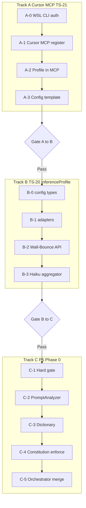

# Phased Execution TODO Runbook

**Status**: ACTIVE — start with Track A; do not skip Gates  
**Owner**: TechSapo Development Team  
**Last updated**: 2026-06-17

Step-by-step checklist for **subscription-quota** development via Cursor MCP and downstream platform work.

| Document | Role |
|----------|------|
| [CURSOR_MCP_PLAN.md](./CURSOR_MCP_PLAN.md) | Policy and phase overview |
| **This file** | Executable steps, acceptance criteria, Gate reviews |

**Progression rule:** Complete **Track A** → Gate A→B → **Track B** → Gate B→C → **Track C**. At each Gate, review logic and methodology before continuing.



---

## How to use

| Symbol | Meaning |
|--------|---------|
| `[ ]` | Not started |
| `[~]` | In progress / partial |
| `[x]` | Done |

Each task block: **Purpose** → **Steps** → **Done when** → **Reflection memo** (fill at Gate).

---

## Current known state (update as you go)

| Item | Status | Notes |
|------|--------|-------|
| `claude` WSL native | `[x]` | `npm install -g @anthropic-ai/claude-code`; OAuth via `~/.claude/.credentials.json` symlink |
| `codex` WSL native | `[ ]` | Windows npm shim fails under WSL; install + `codex login` pending |
| `agy` WSL native | `[~]` | `~/.local/bin/agy` v1.0.7; auth verify pending |
| Cursor MCP registered | `[ ]` | Phase 1 not started |
| Track A complete | `[ ]` | — |
| Gate A→B passed | `[ ]` | — |
| Track B complete | `[ ]` | — |
| Gate B→C passed | `[ ]` | — |
| Track C complete | `[ ]` | — |

---

## Track A — Cursor MCP only (TS-21)

**Do not register Cursor MCP until A-0 sign-off is complete.**

### A-0: WSL native install + authentication

#### A-0.1 Claude Code (Anthropic MAX / OAuth)

**Purpose:** Peer provider CLI on WSL; MAX subscription via OAuth (not API key billing).

**Steps:**

1. Install (WSL):
   ```bash
   npm install -g @anthropic-ai/claude-code
   ```
2. Auth — pick one:
   - **Option A (symlink from Windows):**
     ```bash
     mkdir -p ~/.claude
     ln -sf /mnt/c/Users/<YOU>/.claude/.credentials.json ~/.claude/.credentials.json
     ```
   - **Option B (WSL login):**
     ```bash
     claude login
     ```
3. Prevent API-key override:
   ```bash
   unset ANTHROPIC_API_KEY
   grep -n ANTHROPIC_API_KEY ~/.bashrc ~/.profile 2>/dev/null || true
   # Remove from shell rc if present
   ```
4. Verify:
   ```bash
   which claude                    # MUST NOT be /mnt/c/.../npm/claude
   claude --version
   claude --print --model sonnet --effort low "Reply with only: ok"
   ```

**Done when:** `[x]` WSL path; `[x]` probe returns `ok` without `ANTHROPIC_API_KEY`.

**Troubleshoot:**

| Symptom | Fix |
|---------|-----|
| `Exec format error` | Using Windows `.exe`; install WSL-native package |
| Timeout / auth error | Refresh symlink or run `claude login` in WSL |
| API charges | Unset `ANTHROPIC_API_KEY` |

**Reflection memo:** _Why OAuth over API key for peer provider? Aligns with [SECURITY.md](./SECURITY.md) and subscription quota goal._

---

#### A-0.2 Codex (OpenAI subscription)

**Purpose:** GPT-5 / Codex peer provider on WSL for MCP spawn.

**Steps:**

1. Install (WSL — do **not** use Windows npm):
   ```bash
   npm install -g @openai/codex
   ```
2. Auth:
   ```bash
   codex login
   test -f ~/.codex/auth.json && echo "codex auth ok"
   ```
3. Verify PATH:
   ```bash
   which codex                     # MUST NOT be /mnt/c/...
   codex --version
   ```
4. Non-interactive probe (adjust if CLI differs):
   ```bash
   codex --print "Reply with only: ok" 2>&1 | head -5
   ```

**Done when:** `[ ]` `~/.codex/auth.json` exists under WSL home; `[ ]` probe succeeds.

**Troubleshoot:**

| Symptom | Fix |
|---------|-----|
| `Missing optional dependency @openai/codex-linux-x64` | Reinstall: `npm install -g @openai/codex@latest` in WSL |
| Windows shim on PATH | Reorder PATH; WSL `~/.nvm/.../bin` before `/mnt/c/...` |

**Reflection memo:** _Codex auth file location must match [config/codex-mcp.toml](../config/codex-mcp.toml) `auth_file` (WSL path)._

---

#### A-0.3 Antigravity (`agy`)

**Purpose:** Google Tier 1 peer provider on WSL.

**Steps:**

1. Confirm install:
   ```bash
   which agy
   agy --version
   ```
2. Install if missing:
   ```bash
   curl -fsSL https://antigravity.google/cli/install.sh | bash
   ```
3. Auth:
   ```bash
   agy auth login
   ```
4. Verify:
   ```bash
   agy --print --model gemini-2.5-flash "Reply with only: ok"
   ```

**Done when:** `[~]` auth verified; `[ ]` probe succeeds.

**Troubleshoot:**

| Symptom | Fix |
|---------|-----|
| `agy models` hangs | Network/auth; retry after login |
| Not on PATH | Ensure `~/.local/bin` in PATH |

**Reflection memo:** _agy is already WSL-native; Windows `gemini` npm is legacy per [ANTIGRAVITY_CLI_MIGRATION.md](./ANTIGRAVITY_CLI_MIGRATION.md)._

---

#### A-0.4 Common environment checks

**Steps:**

1. Node.js (WSL):
   ```bash
   node --version   # ≥18
   ```
2. PATH hygiene:
   ```bash
   type -a claude codex agy
   ```
3. Project build:
   ```bash
   cd ~/techdev && npm run build
   ```

**A-0 sign-off (all required before A-1):**

```
[ ] claude  — WSL native + OAuth (no ANTHROPIC_API_KEY)
[ ] codex   — WSL native + ~/.codex/auth.json
[ ] agy     — WSL native + auth
[ ] which claude/codex/agy — no /mnt/c/... npm shims
[ ] npm run build — success
```

---

### A-1: Cursor MCP registration

**Purpose:** Cursor Agent tool calls route to TechSapo MCP servers (subscription quota for tool execution).

**Steps:**

1. Build:
   ```bash
   cd ~/techdev && npm run build
   ```
2. Test MCP servers locally (stdio):
   ```bash
   npm run codex-mcp-test
   ./scripts/start-claude-code-mcp.sh -t
   ```
   > **Note:** `start-claude-code-mcp.sh` may require `ANTHROPIC_API_KEY` in its launcher check — prefer registering Cursor with `npm run claude-code-mcp` directly (OAuth in server) until launcher is fixed.
3. Confirm [config/codex-mcp.toml](../config/codex-mcp.toml):
   ```toml
   auth_file = "/home/<user>/.codex/auth.json"   # WSL path, not Windows
   ```
4. Register in **Cursor Settings → MCP** (or project MCP config). Template: [config/cursor-mcp.template.json](../config/cursor-mcp.template.json)
5. Reload Cursor; confirm tools listed for `techsapo-codex` and `techsapo-claude`.
6. Invoke once from Cursor Agent (e.g. Codex analyze, Claude analyze_with_sonnet45).
7. **Gap (explicit):** `agy` MCP wrapper **TBD** — not required for A-1 completion.

**Done when:** `[ ]` Both MCP servers visible in Cursor; `[ ]` at least one successful tool invoke each.

**Reflection memo:** _Cursor Agent planning still uses Cursor quota; MCP tools use subscription — document which task goes where._

---

### A-2: InferenceProfile in MCP (minimal — Track A scope)

**Purpose:** Pass model / effort / CoT through MCP args (no Wall-Bounce API changes yet — that is Track B).

**Steps:**

1. Claude MCP — extend tool schema to accept optional `model`, `effort`, `cot`; map to CLI `--model`, `--effort`, prompt policy.
   - File: [src/services/claude-code-mcp-server.ts](../src/services/claude-code-mcp-server.ts)
2. Codex MCP — pass `reasoning_effort` from tool args (already partial).
   - Files: [src/services/codex-mcp-server.ts](../src/services/codex-mcp-server.ts), [codex-mcp-integration.ts](../src/services/codex-mcp-integration.ts)
3. Manual test from Cursor:
   - Claude: `model: sonnet`, `effort: medium`, `cot: brief`
   - Codex: `reasoning_effort: medium`
4. Document preset mapping table in commit message / Gate memo.

**Done when:** `[ ]` At least one preset-equivalent invoke succeeds per provider via Cursor MCP.

**Reflection memo:** _Keep adapter logic in MCP servers, not in Cursor config — matches TS-20 adapter boundary._

---

### A-3: Unified config template

**Purpose:** Reproducible Cursor MCP registration for the team.

**Steps:**

1. Copy [config/cursor-mcp.template.json](../config/cursor-mcp.template.json); replace `<REPO_ROOT>` and `<USER>`.
2. Optional: symlink into Cursor user config (location varies by Cursor version / WSL).
3. Update this runbook **Known state** when registered.

**Done when:** `[ ]` Template committed; `[ ]` At least one developer registered from template.

---

### Gate A → B (review before Track B)

**Do not start Track B until all Pass conditions are met.**

| # | Criterion (logic / methodology) | Yes | Memo |
|---|----------------------------------|-----|------|
| G1 | **Transport:** MCP stdio matches [TS-17](./decisions/TECH_STACK_LLM_PROVIDER_TRANSPORT.md) (no HTTP between co-located providers) | | |
| G2 | **Security:** No API keys in code/env for Claude; CLI/OAuth only | | |
| G3 | **Quota:** Team understands Cursor Agent vs MCP tool billing | | |
| G4 | **Provider parity:** claude / codex / agy treated as peer Tier 1–3; Opus aggregator-only | | |
| G5 | **Operability:** A-0 steps reproducible on clean WSL | | |
| G6 | **A-0 sign-off:** All five checkboxes `[x]` | | |
| G7 | **A-1 invoke:** codex + claude MCP each succeeded once from Cursor | | |

**Pass when:** G1–G7 all Yes.

**Gate decision:** `[ ]` Pass → proceed to Track B  /  `[ ]` Fail → fix Track A, re-review

**Reviewer / date:** _______________

---

## Track B — InferenceProfile implementation (TS-20)

**Start only after Gate A→B Pass.**

Reference: [TECH_STACK_INFERENCE_PROFILES.md](./decisions/TECH_STACK_INFERENCE_PROFILES.md)

### B-0: Config + types

**Purpose:** Single schema for model, effort, CoT, temperature.

**Steps:**

1. Add `config/inference-profiles.json` with presets: `fast`, `balanced`, `deep`, `critical`.
2. Add `src/types/inference-profile.ts` with `InferenceProfile` interface.
3. Loader utility (minimal): resolve preset → merge overrides.

**Done when:** `[ ]` JSON validates; `[ ]` types imported without circular deps.

**Verify:**
```bash
npm run build
```

**Reflection memo:** _Presets match [WALL_BOUNCE_SYSTEM.md § Inference Profiles](./WALL_BOUNCE_SYSTEM.md#inference-profiles-model-effort-cot-temperature)._

---

### B-1: Provider adapters

**Purpose:** Map `InferenceProfile` → native CLI/MCP flags; no logic in orchestrator.

| Provider | File(s) | Maps |
|----------|---------|------|
| Claude | `claude-code-mcp-server.ts` | `--model`, `--effort`, cot → prompt |
| Codex | `codex-mcp-server.ts`, `codex-gpt5-provider.ts` | `reasoning_effort`, cot |
| agy | `wall-bounce-analyzer.ts` or new adapter | `--model`, temperature, cot |

**Steps:**

1. Implement pass-through for each provider.
2. Unit or integration test per adapter.
3. Avoid duplicating spawn logic — share with Wall-Bounce where possible.

**Done when:** `[ ]` Each adapter has one test or documented manual probe.

**Reflection memo:** _CoT independent of effort — test `effort: high` + `cot: off` case._

---

### B-2: Wall-Bounce API

**Purpose:** External clients select profile per request.

**Steps:**

1. Extend [wall-bounce-api.ts](../src/routes/wall-bounce-api.ts) request type:
   - `profile?: 'fast' | 'balanced' | 'deep' | 'critical'`
   - `inference?: Partial<Record<string, InferenceProfile>>`
2. Wire into `executeWallBounce` options.
3. Test:
   ```bash
   curl -s -X POST http://localhost:8443/api/v1/wall-bounce/analyze-simple \
     -H 'Content-Type: application/json' \
     -d '{"question":"test","profile":"fast"}' | head
   ```

**Done when:** `[ ]` API accepts profile; `[ ]` at least one provider uses resolved profile.

---

### B-3: Haiku + aggregator preset

**Purpose:** Register Haiku for `fast` preset; pin Opus aggregator to `critical`.

**Steps:**

1. Add Haiku to [llm-providers.json](../src/config/llm-providers.json) and [wall-bounce-analyzer.ts](../src/services/wall-bounce-analyzer.ts).
2. Pin `llm_aggregate` / aggregator path to `critical` preset (Opus, max effort, cot brief).

**Done when:** `[ ]` `fast` can select Haiku; `[ ]` aggregator ignores TaskRouter override for preset.

---

### Gate B → C (review before Track C)

| # | Criterion | Yes | Memo |
|---|-----------|-----|------|
| G1 | **Schema:** effort / cot / temperature independently controllable | | |
| G2 | **Adapter boundary:** No provider-specific flags in orchestrator | | |
| G3 | **Preset consistency:** Matches WALL_BOUNCE_SYSTEM + TS-20 ADR | | |
| G4 | **CoT vs SSE:** UI thinking stream ≠ CoT policy | | |
| G5 | **Doc sync:** ADR, API reference, WALL_BOUNCE_SYSTEM updated | | |
| G6 | **E2E:** One preset works end-to-end (API or MCP) with test record | | |

**Pass when:** G1–G6 all Yes.

**Gate decision:** `[ ]` Pass → proceed to Track C  /  `[ ]` Fail → fix Track B

**Reviewer / date:** _______________

---

## Track C — P5 Phase 0 Platform

**Start only after Gate B→C Pass.**

Reference: [WALL_BOUNCE_P5_ARCHITECTURE.md §4](./decisions/WALL_BOUNCE_P5_ARCHITECTURE.md)

### C-1: Hard gate + confidence

**Purpose:** Block low-quality responses (gap B1).

**Gap:** B1 — fixed confidence values, no hard gate.

**Steps:**

1. Replace fixed confidence with computed scores.
2. Implement hard gate before response return (threshold from constitution: confidence ≥ 0.7, consensus ≥ 0.6).
3. Add tests for reject / escalate paths.

**Done when:** `[ ]` Gate blocks sub-threshold responses in tests.

**Reflection memo:** _Gate runs after Wall-Bounce rounds, not instead of constitution 2–5 rounds._

---

### C-2: PromptAnalyzer + morphological analysis

**Purpose:** Japanese routing accuracy (gaps B5, TS-19).

**Steps:**

1. Select MeCab-class parser (Phase 0 spike).
2. Integrate into PromptAnalyzer (once per request, before Grounding).
3. Feed TaskRouter / dictionary v0 features.

**Done when:** `[ ]` Parse runs on sample Japanese prompts; `[ ]` regex-only path deprecated for routing.

**Reflection memo:** _Parse for routing only — not morpheme substitution of LLM prompts ([P5 §7](./decisions/WALL_BOUNCE_P5_ARCHITECTURE.md#7-形態素解析の位置づけ))._

---

### C-3: Dictionary v0

**Purpose:** Domain term expansion for PromptAnalyzer.

**Steps:**

1. Define dictionary format and location.
2. Wire lookup from morphological parse output.
3. Seed minimal legal/tech terms for testing.

**Done when:** `[ ]` At least one term expands correctly in integration test.

---

### C-4: Constitution round enforce (TS-12)

**Purpose:** Enforce 2–5 rounds in code, not docs only.

**Steps:**

1. Add round counter in `executeWallBounce` (min 2, max 5).
2. Reject single-round execution.
3. Tests: 1 round fails; 2 rounds pass; 6 rounds capped at 5.

**Done when:** `[ ]` Tests prove enforce; `[ ]` matches [CLAUDE.md](../CLAUDE.md) Constitution.

**Reflection memo:** _Constitution is supreme — implementation must not bypass via API flags._

---

### C-5: Orchestrator merge

**Purpose:** Resolve dual Analyzer / Orchestrator implementations (B3, B8).

**Steps:**

1. Inventory [wall-bounce-analyzer.ts](../src/services/wall-bounce-analyzer.ts) vs [wall-bounce-orchestrator.ts](../src/services/wall-bounce-orchestrator.ts).
2. Choose single entry path for API.
3. Deprecate or adapter-wrap legacy path; update tests.

**Done when:** `[ ]` One canonical path documented; `[ ]` `getProviderOrder` supports TaskRouter policy.

---

### Gate C — P5 Phase 0 complete

| # | Criterion | Yes | Memo |
|---|-----------|-----|------|
| G1 | B1 hard gate implemented | | |
| G2 | B5 morphological path active in PromptAnalyzer | | |
| G3 | Dictionary v0 wired | | |
| G4 | TS-12 constitution rounds enforced in code | | |
| G5 | B3/B8 orchestrator unified | | |
| G6 | Docs + tests synced ([documentation-sync](../.cursor/rules/documentation-sync.mdc)) | | |

**Pass when:** G1–G6 all Yes → **P5 Phase 0 platform complete.**

**Gate decision:** `[ ]` Pass  /  `[ ]` Fail

**Reviewer / date:** _______________

---

## Related documents

| Doc | Link |
|-----|------|
| Plan overview | [CURSOR_MCP_PLAN.md](./CURSOR_MCP_PLAN.md) |
| WSL CLI quick ref | [DEVELOPMENT_GUIDE.md § WSL Native CLI](./DEVELOPMENT_GUIDE.md#wsl-native-cli-prerequisites-cursor-mcp-phase-0) |
| InferenceProfile ADR | [TECH_STACK_INFERENCE_PROFILES.md](./decisions/TECH_STACK_INFERENCE_PROFILES.md) |
| P5 architecture | [WALL_BOUNCE_P5_ARCHITECTURE.md](./decisions/WALL_BOUNCE_P5_ARCHITECTURE.md) |
| MCP architecture | [MCP_SERVICES.md](./MCP_SERVICES.md) |
| Backlog TS-21 | [TECH_STACK_WORKSPACE.md](./TECH_STACK_WORKSPACE.md) |

---

## Out of scope (this runbook)

- PPTX updates
- P5 Phase 1+ (Grounding, AWS, NDL)
- Auto-routing shell script (by design — use presets + TaskRouter)
