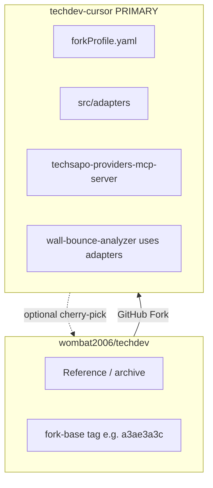

# Full-Fork: techdev-cursor (Primary Development)

**Status**: ACCEPTED — implementation target is the fork, not this upstream repo  
**Owner**: TechSapo Development Team  
**Last updated**: 2026-06-18

**Upstream (this repo):** `wombat2006/techdev` — reference / archive for platform docs and P5 architecture.  
**Primary (fork):** `techdev-cursor` — Cursor MCP, Unified provider server, Provider Adapters, and ongoing DevAssist work.

Related: [CURSOR_MCP_PLAN.md](./CURSOR_MCP_PLAN.md) · [CURSOR_MCP_TODO.md](./CURSOR_MCP_TODO.md) · [MCP_SERVICES.md](./MCP_SERVICES.md) · [P5 §9 Forkable core](./decisions/WALL_BOUNCE_P5_ARCHITECTURE.md#9-フォーク可能コア)

---

## Decisions (locked)

| # | Choice |
|---|--------|
| D1 | MCP topology | **Unified** — single `techsapo-providers` stdio server |
| D2 | Repo model | **Full-Fork** — entire `techdev` tree (not slim repo) |
| D3 | Fork name | **`techdev-cursor`** — Cursor MCP / DevAssist line |
| D4 | Upstream sync | **fork_primary** — fork is primary; upstream is reference |
| D5 | Merge-back | **Optional** — cherry-pick to upstream if needed; not on critical path |

---

## Repository layout



---

## Fork setup

1. GitHub: **Fork** `wombat2006/techdev` → `wombat2006/techdev-cursor`
2. Clone to WSL: `/home/<user>/techdev-cursor`
3. Add remote: `git remote add upstream git@github-techdev:wombat2006/techdev.git`
4. Tag fork base: `git tag fork-base/a3ae3a3c`
5. Update fork `README.md`: **PRIMARY — Cursor MCP / DevAssist line**; link upstream
6. Optional: set `package.json` `name` to `techdev-cursor`

### forkProfile.yaml (fork root)

Per P5 §9 — inherit Wall-Bounce engine; swap fork-specific profile:

```yaml
id: devassist-cursor
displayName: TechSapo DevAssist (Cursor MCP)
description: Cursor IDE integration via unified provider MCP + subscription quota

inherits:
  - wall-bounce-engine
  - sse-api
  - inference-profiles-ts20

swappable:
  taskRouterRules: config/fork/devassist-task-router.json
  dictionary: config/fork/devassist-dictionary-v0.json
  groundingProviders: []
  disclaimerProfile: devassist

cursorMcp:
  server: techsapo-providers
  template: config/cursor-mcp.template.json
  primaryUse: single-provider dev tasks
  productionAnalysis: wall-bounce-api
```

---

## Unified MCP (target architecture)

Single stdio server — **not** dual `techsapo-codex` + `techsapo-claude` registration.

| Tool | Provider | Cursor-safe defaults |
|------|----------|----------------------|
| `analyze_claude` | Claude MAX/OAuth | `--print`, `--strict-mcp-config`, unset `ANTHROPIC_API_KEY` |
| `analyze_codex` | Codex subscription | `codex exec`, non-interactive, `approval_policy=never` |
| `analyze_agy` | Antigravity | `agy --print` |

**Cursor config** (fork clone path; use `node` directly — **not** `npm run codex-mcp`, which daemonizes):

```json
{
  "mcpServers": {
    "techsapo-providers": {
      "command": "node",
      "args": ["dist/services/techsapo-providers-mcp-server.js"],
      "cwd": "/home/<user>/techdev-cursor"
    }
  }
}
```

**New modules (in fork):**

- `src/adapters/{types,claude,codex,agy,inference-profile-resolver}.ts`
- `src/services/techsapo-providers-mcp-server.ts`
- npm script: `techsapo-providers-mcp`

Adapters spawn CLIs only — **no nested MCP**. Wall-Bounce orchestrator refactors to use the same adapters (Track B in fork).

Token & quota: [CURSOR_MCP_TODO § Token & Quota Operations Guide](./CURSOR_MCP_TODO.md#token--quota-operations-guide). Production user-facing multi-LLM analysis uses **Wall-Bounce API**, not chained `analyze_*` tools in Cursor.

---

## Tracks (fork timeline)

| Track | Scope | Priority |
|-------|-------|----------|
| **A-0** | WSL native CLI + auth | Required before MCP register |
| **A-1** | Unified MCP + adapters | **High** |
| **A-2** | InferenceProfile in MCP tool schemas | High |
| **A-3** | Cursor template + team registration | High |
| **Gate A→B** | stdio, quota understanding, 3 tools from Cursor, adapters in orchestrator | Gate |
| **B** | `inference-profiles.json`, Wall-Bounce API profile, remove nested MCP | High |
| **C** | P5 Phase 0 (TS-12, morphological, etc.) | Per Runbook |
| **D** | Tokenizer / usage metrics + response cache | **LOW — after Gate A→B** |

### Track D (LOW PRIORITY)

Not on Gate A→B critical path. Helps subscription-CLI observability (buckets 2–3), **not** Cursor Agent tokens (bucket 1).

| Item | When |
|------|------|
| Response cache (5min in-memory, opt-in) | Track D; optional minimal in A-1 |
| CLI usage parse + Prometheus | Track D |
| Pre-flight prompt size warn (char/4 OK initially) | Track D |
| Provider native prompt cache | Future / optional |

Higher ROI for token savings: InferenceProfile (`fast`, `cot: off`), Ask vs Agent, new chat, single CLI vs Wall-Bounce.

---

## Gate A→B (fork-local)

| # | Criterion |
|---|-----------|
| G1 | stdio transport only (TS-17) |
| G3 | Team understands Cursor Agent vs MCP tool billing |
| G7 | All three `analyze_*` tools succeed from Cursor |
| G8 | `wall-bounce-analyzer` uses adapters (no nested MCP) |
| G9 | `forkProfile.yaml` + this doc committed in fork |

---

## fork_primary governance

| Topic | Rule |
|-------|------|
| Default clone | `techdev-cursor` for Cursor MCP work |
| upstream `techdev` | Read-only reference; tag sync points |
| PRs | Target fork `master` |
| Cursor `cwd` | Fork repo root |

---

## What stays in upstream (this repo)

- Architecture ADRs, Runbook structure, Token Guide
- P5 proposal and platform documentation
- Optional cherry-pick of doc fixes from fork

Implementation code for Unified MCP and adapters is **not** developed on upstream master until optionally merged back from fork.
