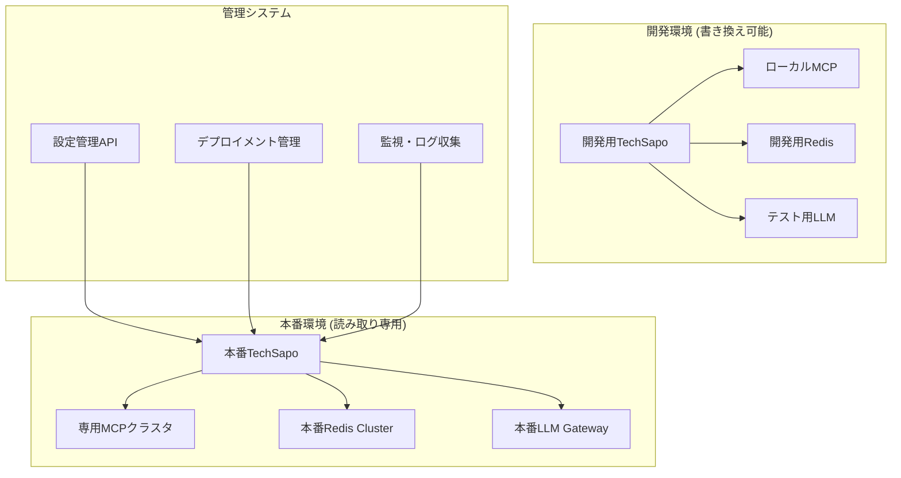
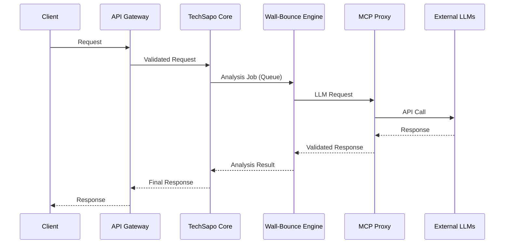

# 🚀 TechSapo 本番システム配置戦略

## 📋 概要

開発専用の現在のTechSapoから、実際の公開システムへの移行戦略。
**重要制約**: 公開システムは自分自身を書き換えてはいけない。

## 🏗️ アーキテクチャ分離設計

### 開発環境 vs 本番環境

| 要素 | 開発環境 | 本番環境 |
|------|----------|----------|
| **コード変更** | 動的変更可能 | **読み取り専用** |
| **MCPサーバ** | ローカル実行 | 分離された専用サーバ |
| **Wall-Bounce** | 完全アクセス | 制限されたAPI経由 |
| **設定変更** | 即座反映 | 管理者承認必須 |
| **ログレベル** | DEBUG | INFO/WARN/ERROR |

### システム分離原則



## 🔒 セキュリティ要件

### 1. 自己変更の禁止

**実装方針:**
- アプリケーションファイルの読み取り専用マウント
- コード実行時の書き込み権限剥奪
- 動的コード生成・実行の無効化

```dockerfile
# 本番用Dockerfile例
FROM node:18-alpine
WORKDIR /app
COPY --chown=node:node . .
RUN npm ci --only=production && npm run build
USER node
# 読み取り専用でアプリケーションをマウント
VOLUME ["/app:ro"]
```

### 2. MCP統合のセキュリティ

**分離原則:**
- MCPサーバは別コンテナ・別ネットワークで実行
- API Gateway経由でのみアクセス
- 認証・認可の厳格化

```yaml
# kubernetes deployment例
apiVersion: v1
kind: ConfigMap
metadata:
  name: mcp-security-config
data:
  allowed_operations: "read,analyze,search"
  forbidden_operations: "write,execute,modify"
```

### 3. Wall-Bounce Analysis制限

**制約事項:**
- 外部LLMとの通信はAPI Gateway経由のみ
- レスポンス内容の自動検証・サニタイゼーション
- 実行可能コードの生成・実行禁止

## 📈 スケーラビリティ設計

### コンポーネント分離

| コンポーネント | スケーリング戦略 | リソース要件 |
|----------------|------------------|--------------|
| **APIサーバ** | 水平スケール | CPU集約型 |
| **Wall-Bounce エンジン** | キュー + ワーカー | メモリ集約型 |
| **MCPプロキシ** | ロードバランサ | ネットワーク集約型 |
| **Redis Cache** | クラスタ構成 | メモリ集約型 |

### 処理分離パターン



## 🚀 デプロイメント戦略

### 環境分離

1. **開発環境** (`techdev`)
   - 現在のリポジトリ
   - 完全な書き換え権限
   - 実験・プロトタイピング用

2. **ステージング環境** (`techsapo-staging`)
   - 本番模擬環境
   - 読み取り専用制約のテスト
   - 性能・セキュリティテスト

3. **本番環境** (`techsapo-production`)
   - 完全分離・読み取り専用
   - 高可用性・災害復旧対応
   - 厳格な変更管理

### CI/CDパイプライン

```yaml
# .github/workflows/production-deploy.yml
name: Production Deployment
on:
  push:
    branches: [main]

jobs:
  security-scan:
    runs-on: ubuntu-latest
    steps:
      - uses: actions/checkout@v3
      - name: Security Scan
        run: |
          # 自己変更コードの検出
          grep -r "fs\.write\|eval\|Function" src/ && exit 1
          # 動的実行の検出
          grep -r "exec\|spawn\|child_process" src/ && exit 1

  deploy:
    needs: security-scan
    runs-on: ubuntu-latest
    steps:
      - name: Deploy to Production
        run: |
          # 読み取り専用デプロイメント
          kubectl apply -f k8s/production/
```

### 設定管理

**開発環境設定:**
```typescript
// 開発環境: 動的設定変更可能
export const devConfig = {
  allowDynamicConfig: true,
  allowCodeModification: true,
  mcpServers: ["local://cipher", "local://serena"],
  debugLevel: "DEBUG"
};
```

**本番環境設定:**
```typescript
// 本番環境: 静的設定のみ
export const prodConfig = {
  allowDynamicConfig: false,
  allowCodeModification: false,
  mcpServers: ["proxy://mcp-gateway"],
  debugLevel: "ERROR"
};
```

## 🔧 運用・監視

### 監視項目

1. **セキュリティ監視**
   - ファイルシステム書き込み試行の検出
   - 異常なAPI呼び出しパターン
   - 権限昇格の試行

2. **パフォーマンス監視**
   - Wall-Bounce分析の処理時間
   - MCPサーバ応答時間
   - リソース使用量

3. **ビジネス監視**
   - 分析精度の品質指標
   - ユーザー満足度
   - システム可用性

### アラート設定

```yaml
# prometheus alerts
groups:
  - name: techsapo-security
    rules:
      - alert: UnauthorizedFileWrite
        expr: filesystem_write_attempts > 0
        for: 0s
        labels:
          severity: critical
        annotations:
          summary: "Unauthorized file write attempt detected"

      - alert: SelfModificationAttempt
        expr: code_modification_attempts > 0
        for: 0s
        labels:
          severity: critical
        annotations:
          summary: "Self-modification attempt detected"
```

## 📚 移行計画

### Phase 1: 基盤整備 (1-2週間)
- [ ] 読み取り専用コンテナ設計
- [ ] MCP分離アーキテクチャ構築
- [ ] セキュリティスキャン自動化

### Phase 2: ステージング構築 (2-3週間)
- [ ] 本番模擬環境作成
- [ ] 制約下での機能テスト
- [ ] パフォーマンステスト

### Phase 3: 本番デプロイ (1週間)
- [ ] 本番環境構築
- [ ] 段階的トラフィック移行
- [ ] 監視・アラート確認

## 🎯 成功指標

- ✅ 自己変更の完全阻止（0件/月）
- ✅ 99.9%以上の可用性
- ✅ セキュリティインシデント0件
- ✅ Wall-Bounce分析品質維持（>90%精度）
- ✅ 応答時間 < 5秒（95%ile）

この戦略により、開発環境の柔軟性を保ちながら、本番環境では安全で信頼性の高いシステムを実現できます。