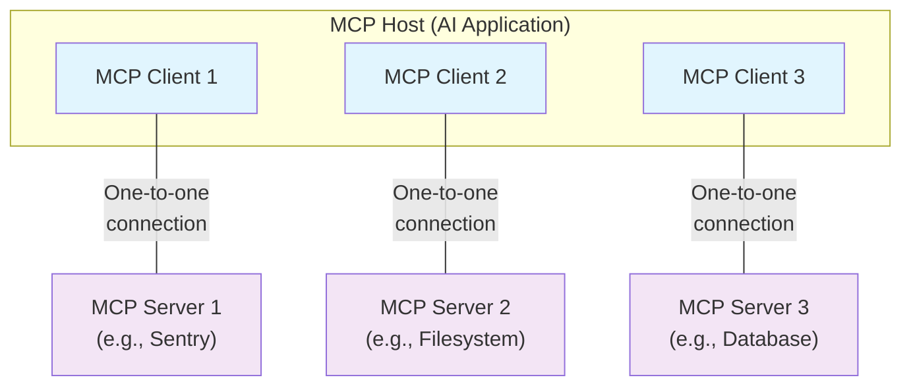
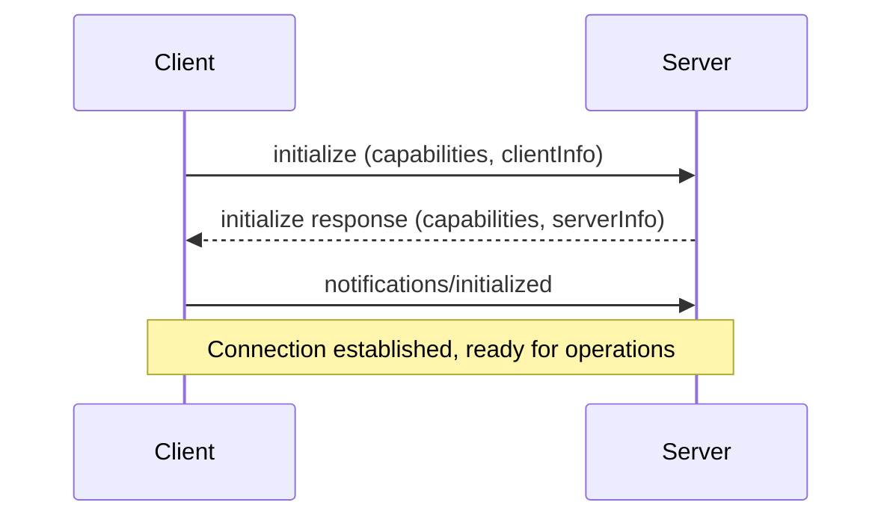

# MCP Architecture Overview

## Scope

The Model Context Protocol (MCP) includes the following projects:

* **[MCP Specification](https://modelcontextprotocol.io/specification/latest)**: A specification of MCP that outlines the implementation requirements for clients and servers
* **[MCP SDKs](/docs/sdk)**: SDKs for different programming languages that implement MCP
* **MCP Development Tools**: Tools for developing MCP servers and clients, including the [MCP Inspector](https://github.com/modelcontextprotocol/inspector)
* **[MCP Reference Server Implementations](https://github.com/modelcontextprotocol/servers)**: Reference implementations of MCP servers

> **Note**: MCP focuses solely on the protocol for context exchange—it does not dictate how AI applications use LLMs or manage the provided context.

## Core Participants

MCP follows a client-server architecture where an MCP host — an AI application like [Claude Code](https://www.anthropic.com/claude-code) or [Claude Desktop](https://www.claude.ai/download) — establishes connections to one or more MCP servers.

### Architecture Overview



### Key Participants

* **MCP Host**: The AI application that coordinates and manages one or multiple MCP clients
* **MCP Client**: A component that maintains a connection to an MCP server and obtains context from an MCP server for the MCP host to use
* **MCP Server**: A program that provides context to MCP clients

**Example**: Visual Studio Code acts as an MCP host. When it connects to the [Sentry MCP server](https://docs.sentry.io/product/sentry-mcp/), VS Code instantiates an MCP client object that maintains the connection. When connecting to another server like the [local filesystem server](https://github.com/modelcontextprotocol/servers/tree/main/src/filesystem), VS Code instantiates an additional MCP client object, maintaining a one-to-one relationship.

### Server Deployment Models

**Local MCP Servers**:
- Run on the same machine as the host application
- Use STDIO transport for direct process communication
- Example: filesystem server launched by Claude Desktop

**Remote MCP Servers**:
- Run on external platforms or cloud services
- Use Streamable HTTP transport for network communication
- Example: [Sentry MCP server](https://docs.sentry.io/product/sentry-mcp/) running on Sentry's platform

## MCP Layers

MCP consists of two distinct layers:

### Data Layer
Defines the JSON-RPC based protocol for client-server communication:

* **Lifecycle Management**: Connection initialization, capability negotiation, and termination
* **Server Features**: Core functionality including tools, resources, and prompts
* **Client Features**: Sampling, elicitation, and logging capabilities
* **Utility Features**: Notifications and progress tracking

### Transport Layer
Manages communication channels and authentication:

* **STDIO Transport**: Standard input/output streams for local process communication
* **Streamable HTTP Transport**: HTTP POST with optional Server-Sent Events for remote servers

## Data Layer Protocol

### Core Architecture

MCP uses [JSON-RPC 2.0](https://www.jsonrpc.org/) as its underlying RPC protocol. The data layer defines the schema and semantics between MCP clients and servers.

### Lifecycle Management

MCP is a stateful protocol requiring capability negotiation through an initialization handshake:



### Server Primitives

MCP defines three core primitives that **servers** expose:

#### 1. Tools
Executable functions that AI applications can invoke to perform actions:

```json
{
  "name": "calculator_arithmetic",
  "title": "Calculator",
  "description": "Perform mathematical calculations",
  "inputSchema": {
    "type": "object",
    "properties": {
      "expression": {
        "type": "string",
        "description": "Mathematical expression to evaluate"
      }
    },
    "required": ["expression"]
  }
}
```

**Methods**:
- `tools/list`: Discover available tools
- `tools/call`: Execute a specific tool

#### 2. Resources
Data sources that provide contextual information:

```json
{
  "uri": "file:///project/README.md",
  "name": "Project README",
  "mimeType": "text/markdown",
  "description": "Main project documentation"
}
```

**Methods**:
- `resources/list`: List available resources
- `resources/templates/list`: List resource templates
- `resources/read`: Retrieve resource contents

#### 3. Prompts
Reusable templates for structuring LLM interactions:

```json
{
  "name": "code_review",
  "title": "Code Review Assistant",
  "description": "Analyze code for best practices and potential issues",
  "arguments": [
    {
      "name": "language",
      "type": "string",
      "description": "Programming language"
    }
  ]
}
```

**Methods**:
- `prompts/list`: Discover available prompts
- `prompts/get`: Retrieve prompt details

### Client Primitives

MCP defines primitives that **clients** expose to enable richer server interactions:

#### 1. Sampling
Allows servers to request LLM completions from the client:

```json
{
  "method": "sampling/createMessage",
  "params": {
    "messages": [
      {
        "role": "user",
        "content": "Analyze these flight options and recommend the best choice"
      }
    ],
    "modelPreferences": {
      "hints": [{"name": "claude-3-5-sonnet"}],
      "intelligencePriority": 0.9
    }
  }
}
```

#### 2. Elicitation
Enables servers to request specific information from users:

```json
{
  "method": "elicitation/create",
  "params": {
    "message": "Please confirm your booking details:",
    "schema": {
      "type": "object",
      "properties": {
        "confirmBooking": {"type": "boolean"},
        "seatPreference": {"type": "string", "enum": ["window", "aisle"]}
      }
    }
  }
}
```

#### 3. Logging
Allows servers to send log messages to clients:

```json
{
  "method": "logging/setLevel",
  "params": {
    "level": "debug"
  }
}
```

### Notifications

Real-time updates enable dynamic synchronization:

```json
{
  "jsonrpc": "2.0",
  "method": "notifications/tools/list_changed"
}
```

Common notification types:
- `notifications/tools/list_changed`: Tool availability updates
- `notifications/resources/list_changed`: Resource changes
- `notifications/prompts/list_changed`: Prompt updates

## Protocol Flow Example

### 1. Initialization

**Client Request**:
```json
{
  "jsonrpc": "2.0",
  "id": 1,
  "method": "initialize",
  "params": {
    "protocolVersion": "2025-06-18",
    "capabilities": {
      "elicitation": {}
    },
    "clientInfo": {
      "name": "example-client",
      "version": "1.0.0"
    }
  }
}
```

**Server Response**:
```json
{
  "jsonrpc": "2.0",
  "id": 1,
  "result": {
    "protocolVersion": "2025-06-18",
    "capabilities": {
      "tools": {"listChanged": true},
      "resources": {}
    },
    "serverInfo": {
      "name": "example-server",
      "version": "1.0.0"
    }
  }
}
```

**Ready Notification**:
```json
{
  "jsonrpc": "2.0",
  "method": "notifications/initialized"
}
```

### 2. Tool Discovery

**Discovery Request**:
```json
{
  "jsonrpc": "2.0",
  "id": 2,
  "method": "tools/list"
}
```

**Discovery Response**:
```json
{
  "jsonrpc": "2.0",
  "id": 2,
  "result": {
    "tools": [
      {
        "name": "weather_current",
        "title": "Weather Information",
        "description": "Get current weather information for any location",
        "inputSchema": {
          "type": "object",
          "properties": {
            "location": {"type": "string"},
            "units": {"type": "string", "enum": ["metric", "imperial"]}
          },
          "required": ["location"]
        }
      }
    ]
  }
}
```

### 3. Tool Execution

**Execution Request**:
```json
{
  "jsonrpc": "2.0",
  "id": 3,
  "method": "tools/call",
  "params": {
    "name": "weather_current",
    "arguments": {
      "location": "San Francisco",
      "units": "imperial"
    }
  }
}
```

**Execution Response**:
```json
{
  "jsonrpc": "2.0",
  "id": 3,
  "result": {
    "content": [
      {
        "type": "text",
        "text": "Current weather in San Francisco: 68°F, partly cloudy with light winds from the west at 8 mph. Humidity: 65%"
      }
    ]
  }
}
```

### 4. Real-time Updates

**Change Notification**:
```json
{
  "jsonrpc": "2.0",
  "method": "notifications/tools/list_changed"
}
```

**Client Response** (refresh tool list):
```json
{
  "jsonrpc": "2.0",
  "id": 4,
  "method": "tools/list"
}
```

## Integration with AI Applications

### Host Application Workflow

```python
# Pseudo-code for AI application integration
async with stdio_client(server_config) as (read, write):
    async with ClientSession(read, write) as session:
        # Initialize connection
        init_response = await session.initialize()

        # Register server capabilities
        if init_response.capabilities.tools:
            app.register_mcp_server(session, supports_tools=True)

        # Discover available tools
        tools_response = await session.list_tools()
        available_tools.extend(tools_response.tools)

        # Make tools available to LLM
        conversation.register_available_tools(available_tools)

        app.set_server_ready(session)
```

### Tool Execution in Conversations

```python
# Handle LLM tool calls
async def handle_tool_call(conversation, tool_name, arguments):
    session = app.find_mcp_session_for_tool(tool_name)
    result = await session.call_tool(tool_name, arguments)
    conversation.add_tool_result(result.content)
```

### Notification Handling

```python
# React to server notifications
async def handle_tools_changed_notification(session):
    tools_response = await session.list_tools()
    app.update_available_tools(session, tools_response.tools)
    if app.conversation.is_active():
        app.conversation.notify_llm_of_new_capabilities()
```

## Key Design Principles

### 1. Stateful Protocol
- Requires lifecycle management and capability negotiation
- Maintains connection state for efficient communication
- Supports real-time updates through notifications

### 2. Capability-Based
- Clients and servers declare supported features during initialization
- Operations are scoped to negotiated capabilities
- Enables graceful degradation and forward compatibility

### 3. Transport Agnostic
- Same JSON-RPC protocol works across different transport mechanisms
- STDIO for local, HTTP for remote connections
- Transport layer abstracts communication details

### 4. Extensible Primitives
- Core primitives (tools, resources, prompts) provide foundation
- Additional primitives can be added without breaking existing implementations
- Schema-based validation ensures type safety

### 5. Security Focused
- Client maintains control over all operations
- User approval workflows for sensitive actions
- Sandbox execution environments and permission boundaries

## Error Handling

### Standard JSON-RPC Errors

```json
{
  "jsonrpc": "2.0",
  "id": 1,
  "error": {
    "code": -32602,
    "message": "Invalid params",
    "data": {
      "details": "Missing required parameter 'location'"
    }
  }
}
```

### MCP-Specific Error Codes

| Code | Meaning | Description |
|------|---------|-------------|
| -32000 | Internal Error | Server internal error |
| -32001 | Invalid Request | Malformed MCP request |
| -32002 | Method Not Found | Unknown method name |
| -32003 | Invalid Params | Invalid method parameters |

### Error Recovery Strategies

1. **Graceful Degradation**: Continue operation with reduced functionality
2. **Retry Logic**: Automatic retry for transient failures
3. **User Feedback**: Clear error messages and recovery suggestions
4. **Fallback Mechanisms**: Alternative approaches when primary methods fail

## Performance Considerations

### Connection Management
- Maintain persistent connections for efficiency
- Implement connection pooling for multiple servers
- Handle graceful disconnection and reconnection

### Message Optimization
- Batch related operations when possible
- Use efficient serialization and compression
- Minimize round-trip latency

### Resource Usage
- Implement proper memory management
- Monitor and limit resource consumption
- Use streaming for large data transfers

### Caching Strategies
- Cache tool/resource listings for performance
- Implement intelligent cache invalidation
- Balance freshness with performance

This architectural overview provides the foundation for understanding how MCP enables AI applications to securely and efficiently integrate with external systems and data sources through a standardized protocol.