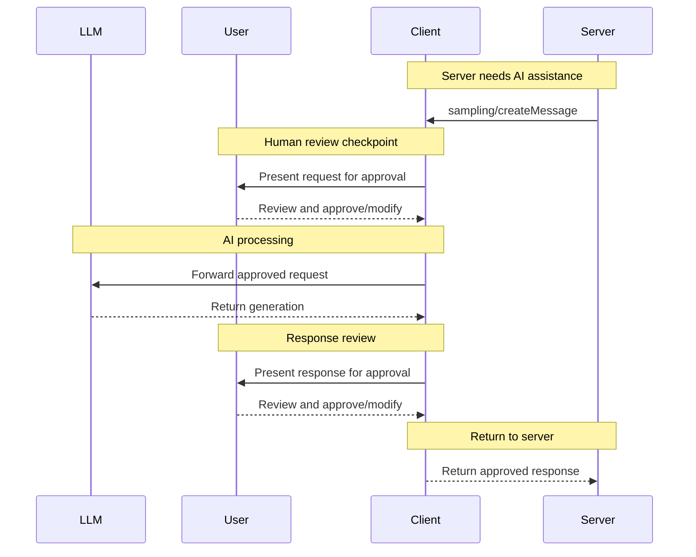
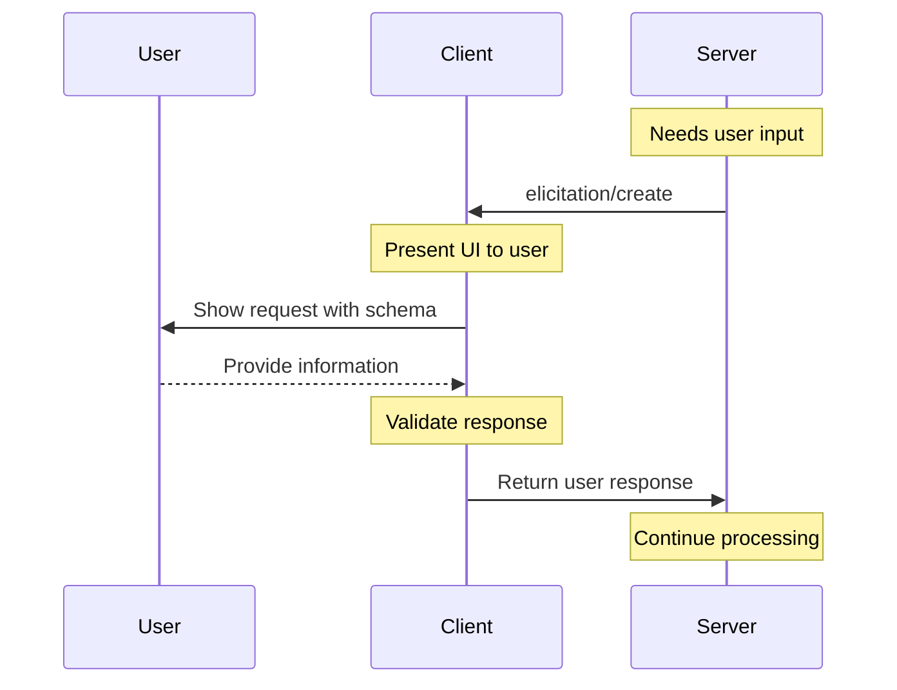

# MCP Clients and Host Applications

## Overview

MCP clients are instantiated by host applications to communicate with MCP servers. The host application (like Claude.ai or an IDE) manages the overall user experience and coordinates multiple clients, while each client handles direct communication with one server.

### Key Distinction
- **Host Application**: The user-facing application that manages the overall experience
- **MCP Client**: Protocol-level component that enables server connections
- **MCP Server**: Provides tools, resources, and prompts to clients

## Client Architecture

### Multi-Client Coordination
```
Host Application
├── MCP Client A ←→ File System Server
├── MCP Client B ←→ Database Server
├── MCP Client C ←→ GitHub Server
└── MCP Client D ←→ Serena Code Server
```

Each client maintains one dedicated connection to one server, allowing the host to orchestrate multiple capabilities simultaneously.

## Core Client Features

Clients provide three key features that enable richer server interactions:

### 1. Sampling
**Purpose**: Allows servers to request LLM completions through the client
**Use Case**: Agentic workflows where servers need AI assistance
**Security**: Client maintains complete control over permissions and model access

### 2. Roots
**Purpose**: Defines filesystem boundaries for server operations
**Use Case**: Guides servers to relevant directories while maintaining security
**Security**: Client controls actual file access regardless of root definitions

### 3. Elicitation
**Purpose**: Enables servers to request specific information from users
**Use Case**: Dynamic information gathering during interactions
**Security**: User controls what information to provide and when

## Sampling: AI-Powered Server Workflows

### How Sampling Works

Sampling enables servers to leverage AI capabilities without direct model access:



### Sampling Request Structure

```typescript
interface SamplingRequest {
  messages: Array<{
    role: "user" | "assistant" | "system";
    content: string;
  }>;
  modelPreferences?: {
    hints?: Array<{ name: string }>;
    costPriority?: number;      // 0-1, preference for lower cost
    speedPriority?: number;     // 0-1, preference for faster response
    intelligencePriority?: number; // 0-1, preference for more capable models
  };
  systemPrompt?: string;
  maxTokens?: number;
  temperature?: number;
}
```

### Practical Example: Flight Analysis

A travel booking server analyzing flight options:

```typescript
// Server requests AI analysis
const samplingRequest = {
  messages: [{
    role: "user",
    content: `Analyze these flight options and recommend the best choice:

Flight Options (47 total):
- Delta 123: NYC→BCN, $650, 8:00 AM departure, 1 stop
- United 456: NYC→BCN, $580, 11:30 PM departure, direct
- Lufthansa 789: NYC→BCN, $720, 9:15 AM departure, direct
[... 44 more flights]

User Preferences:
- Morning departure preferred
- Maximum 1 layover
- Budget: up to $800
- Travel date: June 15, 2024

Please analyze trade-offs and recommend top 3 options with reasoning.`
  }],
  modelPreferences: {
    hints: [{ name: "claude-3-5-sonnet" }],
    costPriority: 0.2,
    speedPriority: 0.1,
    intelligencePriority: 0.9  // Complex analysis needed
  },
  systemPrompt: "You are a travel expert helping users find optimal flights based on their preferences and constraints.",
  maxTokens: 2000
};
```

### Security and Control

#### User Approval Workflow
1. **Request Review**: User sees what the server wants to analyze
2. **Modification Rights**: User can edit the prompt before sending
3. **Response Review**: User reviews AI output before it returns to server
4. **Transparency**: Full visibility into model selection and parameters

#### Configuration Options
```typescript
interface SamplingConfig {
  autoApprove: {
    trustedServers: string[];
    maxTokens: number;
    requireApprovalFor: string[]; // e.g., ["personal_data", "financial"]
  };
  modelRestrictions: {
    allowedModels: string[];
    defaultModel: string;
    maxCostPerRequest: number;
  };
  privacySettings: {
    redactPII: boolean;
    logRequests: boolean;
    shareUsageStats: boolean;
  };
}
```

## Roots: Filesystem Boundary Management

### Root Structure

Roots define which directories servers can access:

```typescript
interface Root {
  uri: string;  // Always file:// URI scheme
  name?: string; // Human-readable name
}

// Example roots configuration
const roots = [
  {
    uri: "file:///Users/agent/travel-planning",
    name: "Travel Planning Workspace"
  },
  {
    uri: "file:///Users/agent/travel-templates",
    name: "Travel Templates"
  },
  {
    uri: "file:///Users/agent/client-documents",
    name: "Client Documents"
  }
];
```

### Dynamic Root Management

Roots can change during client sessions:

```typescript
// Notify servers when roots change
client.notification("roots/list_changed", {
  roots: updatedRootsList
});
```

### Security Boundaries

While roots provide guidance, clients maintain ultimate control:

```typescript
class SecureFileAccess {
  constructor(private roots: Root[], private securityPolicy: SecurityPolicy) {}

  async readFile(path: string): Promise<string> {
    // Check if path is within allowed roots
    if (!this.isWithinRoots(path)) {
      throw new Error("File access outside permitted roots");
    }

    // Apply additional security checks
    if (!this.securityPolicy.allowFileRead(path)) {
      throw new Error("Security policy prevents file access");
    }

    return await fs.readFile(path, 'utf8');
  }

  private isWithinRoots(path: string): boolean {
    return this.roots.some(root =>
      path.startsWith(root.uri.replace('file://', ''))
    );
  }
}
```

### Use Case: Development Workspace

A code analysis server working with project files:

```typescript
// Development workspace roots
const devRoots = [
  { uri: "file:///workspace/src", name: "Source Code" },
  { uri: "file:///workspace/tests", name: "Test Files" },
  { uri: "file:///workspace/docs", name: "Documentation" },
  { uri: "file:///workspace/config", name: "Configuration" }
];

// Server can access files within these boundaries
// But client controls actual file operations
```

## Elicitation: Dynamic Information Gathering

### Elicitation Flow

Servers can request information from users during operations:



### Elicitation Request Schema

```typescript
interface ElicitationRequest {
  message: string;
  schema: JSONSchema;
  timeout?: number;
  priority?: "low" | "normal" | "high";
}

// Example: Booking confirmation
const bookingConfirmation: ElicitationRequest = {
  message: "Please confirm your Barcelona vacation booking details:",
  schema: {
    type: "object",
    properties: {
      confirmBooking: {
        type: "boolean",
        description: "Confirm the booking (Flights + Hotel = $3,000)"
      },
      seatPreference: {
        type: "string",
        enum: ["window", "aisle", "no preference"],
        description: "Preferred seat type for flights"
      },
      roomType: {
        type: "string",
        enum: ["sea view", "city view", "garden view"],
        description: "Preferred room type at hotel"
      },
      travelInsurance: {
        type: "boolean",
        default: false,
        description: "Add travel insurance ($150)"
      },
      specialRequests: {
        type: "string",
        description: "Any special requests or dietary requirements"
      }
    },
    required: ["confirmBooking"]
  },
  timeout: 300000, // 5 minutes
  priority: "high"
};
```

### UI Presentation

Clients render elicitation requests with appropriate UI:

```typescript
class ElicitationUI {
  renderRequest(request: ElicitationRequest): Promise<any> {
    return new Promise((resolve, reject) => {
      const dialog = this.createDialog({
        title: `Information Request from ${serverName}`,
        message: request.message,
        schema: request.schema,
        onSubmit: (data) => {
          if (this.validateResponse(data, request.schema)) {
            resolve(data);
          } else {
            this.showValidationErrors();
          }
        },
        onCancel: () => reject(new Error("User cancelled")),
        timeout: request.timeout
      });

      this.showDialog(dialog);
    });
  }

  private createFormFields(schema: JSONSchema): FormField[] {
    // Generate appropriate UI controls based on schema
    // - boolean -> checkbox
    // - enum -> dropdown/radio buttons
    // - string -> text input
    // - object -> nested form
    return schema.properties.map(prop => this.createField(prop));
  }
}
```

### Privacy and Security

#### Safe Information Requests
```typescript
const UNSAFE_REQUEST_PATTERNS = [
  /password/i,
  /api.?key/i,
  /secret/i,
  /token/i,
  /credential/i
];

class ElicitationSecurity {
  validateRequest(request: ElicitationRequest): boolean {
    // Check for unsafe information requests
    const requestText = JSON.stringify(request);
    const hasUnsafePattern = UNSAFE_REQUEST_PATTERNS.some(pattern =>
      pattern.test(requestText)
    );

    if (hasUnsafePattern) {
      this.warnUser("Server requesting potentially sensitive information");
      return false;
    }

    return true;
  }

  sanitizeResponse(response: any): any {
    // Remove or redact sensitive data before sending to server
    return this.recursivelyRedact(response, this.sensitiveFieldPatterns);
  }
}
```

#### User Control Mechanisms
```typescript
interface ElicitationControls {
  // User can modify what information to share
  customizeResponse(originalResponse: any): any;

  // User can decline to provide information
  declineWithReason(reason?: string): void;

  // User can set automatic responses for common requests
  createAutoResponse(pattern: string, response: any): void;

  // User can block servers from making certain requests
  blockRequestType(serverName: string, requestType: string): void;
}
```

## Client Implementation Patterns

### Basic Client Setup

```typescript
import { MCPClient } from '@modelcontextprotocol/sdk/client.js';

class HostApplicationClient {
  private clients: Map<string, MCPClient> = new Map();

  async addServer(serverConfig: ServerConfig): Promise<void> {
    const client = new MCPClient({
      name: serverConfig.name,
      version: "1.0.0"
    });

    // Configure client features
    await this.setupSampling(client);
    await this.setupRoots(client);
    await this.setupElicitation(client);

    // Connect to server
    await client.connect(serverConfig.transport);

    this.clients.set(serverConfig.name, client);
  }

  private async setupSampling(client: MCPClient): Promise<void> {
    client.setSamplingHandler(async (request) => {
      // Review request with user
      const approved = await this.reviewSamplingRequest(request);
      if (!approved) {
        throw new Error("Sampling request denied by user");
      }

      // Send to AI model
      const response = await this.aiModel.complete(request);

      // Review response with user
      const finalResponse = await this.reviewSamplingResponse(response);
      return finalResponse;
    });
  }

  private async setupRoots(client: MCPClient): Promise<void> {
    const roots = await this.getRootsFromWorkspace();
    await client.setRoots(roots);

    // Update roots when workspace changes
    this.onWorkspaceChange((newRoots) => {
      client.notification("roots/list_changed", { roots: newRoots });
    });
  }

  private async setupElicitation(client: MCPClient): Promise<void> {
    client.setElicitationHandler(async (request) => {
      // Validate request safety
      if (!this.validateElicitationRequest(request)) {
        throw new Error("Unsafe elicitation request blocked");
      }

      // Present UI to user
      const response = await this.showElicitationUI(request);

      // Sanitize response before returning
      return this.sanitizeElicitationResponse(response);
    });
  }
}
```

### Multi-Server Orchestration

```typescript
class MultiServerOrchestrator {
  private clients: Map<string, MCPClient> = new Map();

  async executeWorkflow(workflow: WorkflowDefinition): Promise<any> {
    const results = new Map<string, any>();

    for (const step of workflow.steps) {
      const client = this.clients.get(step.serverName);
      if (!client) {
        throw new Error(`Server ${step.serverName} not available`);
      }

      try {
        const result = await this.executeStep(client, step, results);
        results.set(step.id, result);
      } catch (error) {
        await this.handleStepError(step, error, results);
      }
    }

    return this.combineResults(results, workflow.output);
  }

  private async executeStep(
    client: MCPClient,
    step: WorkflowStep,
    previousResults: Map<string, any>
  ): Promise<any> {
    // Prepare step context from previous results
    const context = this.buildStepContext(step.dependencies, previousResults);

    switch (step.type) {
      case 'tool':
        return await client.callTool(step.toolName, {
          ...step.arguments,
          ...context
        });

      case 'resource':
        return await client.readResource(step.resourceUri);

      case 'prompt':
        return await client.getPrompt(step.promptName, {
          ...step.arguments,
          ...context
        });

      default:
        throw new Error(`Unknown step type: ${step.type}`);
    }
  }
}
```

### Error Handling and Resilience

```typescript
class ResilientClient {
  private retryConfig = {
    maxAttempts: 3,
    backoffMs: 1000,
    backoffMultiplier: 2
  };

  async callWithRetry<T>(
    operation: () => Promise<T>,
    context: string
  ): Promise<T> {
    let lastError: Error;

    for (let attempt = 1; attempt <= this.retryConfig.maxAttempts; attempt++) {
      try {
        return await operation();
      } catch (error) {
        lastError = error;

        if (!this.isRetryableError(error) || attempt === this.retryConfig.maxAttempts) {
          throw error;
        }

        const delayMs = this.retryConfig.backoffMs *
          Math.pow(this.retryConfig.backoffMultiplier, attempt - 1);

        console.warn(`${context} failed (attempt ${attempt}), retrying in ${delayMs}ms:`, error);
        await this.delay(delayMs);
      }
    }

    throw lastError;
  }

  private isRetryableError(error: Error): boolean {
    // Network errors, timeouts, temporary server issues
    return error.message.includes('ECONNRESET') ||
           error.message.includes('timeout') ||
           error.message.includes('503') ||
           error.message.includes('502');
  }

  private delay(ms: number): Promise<void> {
    return new Promise(resolve => setTimeout(resolve, ms));
  }
}
```

## Best Practices for Client Development

### Security First
- Always validate server requests before presenting to users
- Implement approval workflows for sensitive operations
- Sanitize data before sharing with servers
- Respect user privacy preferences

### User Experience
- Provide clear context for server requests
- Allow users to customize and control interactions
- Show progress and status for long-running operations
- Handle errors gracefully with helpful messages

### Performance
- Cache frequently accessed resources
- Use connection pooling for multiple servers
- Implement request batching where possible
- Monitor resource usage and set limits

### Reliability
- Implement proper error handling and recovery
- Use timeouts for all operations
- Gracefully handle server disconnections
- Provide offline functionality where possible

## Host Application Integration

### Configuration Management

```typescript
interface ClientConfiguration {
  servers: ServerConfig[];
  security: SecurityConfig;
  ui: UIConfig;
  performance: PerformanceConfig;
}

interface ServerConfig {
  name: string;
  transport: TransportConfig;
  features: {
    sampling: boolean;
    roots: boolean;
    elicitation: boolean;
  };
  security: {
    trustedLevel: "low" | "medium" | "high";
    allowedOperations: string[];
    maxResourceUsage: ResourceLimits;
  };
}
```

### User Interface Integration

```typescript
class MCPHostUI {
  // Display active server connections
  renderServerStatus(): JSX.Element {
    return (
      <ServerPanel>
        {this.clients.map(client => (
          <ServerCard
            key={client.name}
            client={client}
            onDisconnect={() => this.disconnectServer(client.name)}
            onConfigure={() => this.configureServer(client.name)}
          />
        ))}
      </ServerPanel>
    );
  }

  // Show sampling requests to user
  async reviewSamplingRequest(request: SamplingRequest): Promise<boolean> {
    return new Promise(resolve => {
      this.showModal(
        <SamplingReviewDialog
          request={request}
          onApprove={() => resolve(true)}
          onDeny={() => resolve(false)}
          onModify={(modified) => {
            // Allow user to edit the request
            Object.assign(request, modified);
            resolve(true);
          }}
        />
      );
    });
  }

  // Present elicitation requests
  async showElicitationForm(request: ElicitationRequest): Promise<any> {
    return new Promise((resolve, reject) => {
      this.showModal(
        <ElicitationForm
          request={request}
          onSubmit={resolve}
          onCancel={() => reject(new Error("User cancelled"))}
        />
      );
    });
  }
}
```

This completes the MCP client documentation, providing the counterpart to the server-focused documentation and giving a complete picture of the MCP ecosystem from both client and server perspectives.