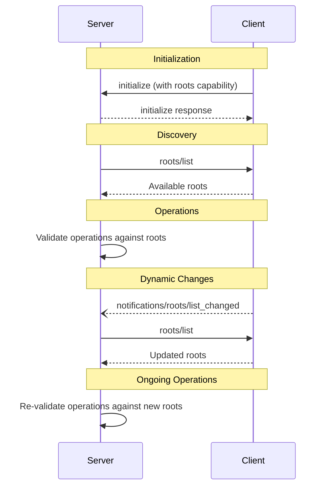

# MCP Roots Guide

> Complete guide to implementing and using filesystem roots in the Model Context Protocol for secure directory and file access control

**Protocol Revision**: 2025-06-18

The Model Context Protocol (MCP) provides a standardized way for clients to expose filesystem "roots" to servers. Roots define the boundaries of where servers can operate within the filesystem, allowing them to understand which directories and files they have access to. This guide covers the implementation, security considerations, and best practices for working with MCP roots.

## Overview

Roots in MCP serve as security boundaries that define the scope of filesystem access for MCP servers. They provide:

* **Access Control**: Define which directories and files servers can access
* **Security Boundaries**: Prevent unauthorized access to sensitive filesystem areas
* **Workspace Management**: Enable project-aware server functionality
* **Dynamic Configuration**: Support for runtime changes to accessible areas
* **User Consent**: Clear user control over exposed filesystem areas

## Core Concepts

### What are Roots?

Roots are filesystem locations (directories or files) that clients explicitly expose to MCP servers. They act as:

1. **Permission Boundaries**: Servers can only operate within defined roots
2. **Context Providers**: Give servers understanding of project structure
3. **Security Gates**: Prevent access to unauthorized filesystem areas
4. **Workspace Definitions**: Define the scope of server operations

### Root Characteristics

* **URI-based**: All roots are identified by file:// URIs
* **Named**: Optional human-readable names for display purposes
* **Dynamic**: Can change during server lifetime with notifications
* **Hierarchical**: Can include nested directory structures
* **Validated**: Must be accessible and properly permissioned

## User Interaction Model

Roots in MCP are typically exposed through workspace or project configuration interfaces, but implementations have flexibility in how they present this to users.

### Common Implementation Patterns

#### Project/Workspace Picker

```javascript
// Example workspace picker interface
class WorkspacePicker {
  async selectRoots() {
    const workspaces = await this.detectWorkspaces();
    const userSelection = await this.promptUserSelection(workspaces);
    return this.validateAndFormatRoots(userSelection);
  }

  async detectWorkspaces() {
    return [
      // Git repositories
      ...await this.findGitRepos(),
      // Project files (package.json, Cargo.toml, etc.)
      ...await this.findProjectFiles(),
      // User-configured workspaces
      ...await this.loadUserWorkspaces()
    ];
  }
}
```

#### Manual Directory Selection

```javascript
// File dialog for manual root selection
const selectedDirectories = await showDirectoryPicker({
  multiple: true,
  title: "Select directories for MCP server access"
});

const roots = selectedDirectories.map(dir => ({
  uri: `file://${dir.path}`,
  name: dir.name
}));
```

#### Configuration-Based Exposure

```json
{
  "mcp_roots": [
    {
      "path": "/home/user/projects/frontend",
      "name": "Frontend Project",
      "permissions": ["read", "write"]
    },
    {
      "path": "/home/user/docs/api",
      "name": "API Documentation",
      "permissions": ["read"]
    }
  ]
}
```

### Automatic Workspace Detection

```javascript
class AutoWorkspaceDetector {
  async detectFromVersionControl() {
    // Detect Git repositories
    const gitRepos = await this.findGitRepositories();

    // Detect SVN workspaces
    const svnWorkspaces = await this.findSvnWorkspaces();

    return [...gitRepos, ...svnWorkspaces];
  }

  async detectFromProjectFiles() {
    const projectMarkers = [
      'package.json',    // Node.js
      'Cargo.toml',      // Rust
      'pom.xml',         // Maven
      'build.gradle',    // Gradle
      'pyproject.toml',  // Python
      'composer.json',   // PHP
      'Gemfile',         // Ruby
      'go.mod'           // Go
    ];

    const projects = [];
    for (const marker of projectMarkers) {
      const found = await this.findFilesNamed(marker);
      projects.push(...found.map(f => path.dirname(f)));
    }

    return projects;
  }
}
```

## Protocol Implementation

### Capabilities Declaration

Clients that support roots **MUST** declare the `roots` capability during initialization:

```json
{
  "jsonrpc": "2.0",
  "id": 1,
  "method": "initialize",
  "params": {
    "protocolVersion": "2025-06-18",
    "capabilities": {
      "roots": {
        "listChanged": true
      }
    },
    "clientInfo": {
      "name": "example-client",
      "version": "1.0.0"
    }
  }
}
```

The `listChanged` property indicates whether the client will emit notifications when the list of roots changes.

### Listing Roots

Servers can request the current list of roots using the `roots/list` method:

#### Request Format

```json
{
  "jsonrpc": "2.0",
  "id": 1,
  "method": "roots/list"
}
```

#### Response Format

```json
{
  "jsonrpc": "2.0",
  "id": 1,
  "result": {
    "roots": [
      {
        "uri": "file:///home/user/projects/myproject",
        "name": "My Project"
      },
      {
        "uri": "file:///home/user/docs/specifications",
        "name": "Technical Specifications"
      }
    ]
  }
}
```

#### Implementation Example

```typescript
// Client-side implementation
class McpClient {
  private roots: Root[] = [];

  async handleRootsListRequest(): Promise<RootsListResponse> {
    return {
      roots: this.roots.map(root => ({
        uri: root.uri,
        name: root.name
      }))
    };
  }

  async addRoot(path: string, name?: string): Promise<void> {
    // Validate path accessibility
    await this.validatePath(path);

    const root: Root = {
      uri: `file://${path}`,
      name: name || path.basename(path)
    };

    this.roots.push(root);

    // Notify servers of changes
    if (this.capabilities.roots?.listChanged) {
      await this.notifyRootsChanged();
    }
  }

  private async validatePath(path: string): Promise<void> {
    try {
      const stats = await fs.stat(path);
      if (!stats.isDirectory() && !stats.isFile()) {
        throw new Error('Path must be a file or directory');
      }
    } catch (error) {
      throw new Error(`Invalid path: ${error.message}`);
    }
  }
}
```

```python
# Server-side implementation
class McpServer:
    def __init__(self):
        self.roots = []

    async def request_roots(self):
        """Request current roots from client"""
        response = await self.send_request({
            "method": "roots/list"
        })

        self.roots = response.get("result", {}).get("roots", [])
        return self.roots

    def is_path_within_roots(self, path: str) -> bool:
        """Check if a path is within any of the defined roots"""
        abs_path = os.path.abspath(path)

        for root in self.roots:
            # Convert URI to local path
            root_path = uri_to_path(root["uri"])

            # Check if path is within root
            if abs_path.startswith(root_path):
                return True

        return False

    async def safe_file_operation(self, path: str):
        """Perform file operation only if within roots"""
        if not self.is_path_within_roots(path):
            raise PermissionError(f"Path {path} is outside allowed roots")

        # Proceed with operation
        return await self.perform_file_operation(path)
```

### Root List Change Notifications

When the list of roots changes, clients that support `listChanged` **MUST** send a notification:

```json
{
  "jsonrpc": "2.0",
  "method": "notifications/roots/list_changed"
}
```

#### Implementation Example

```typescript
class McpClient {
  async notifyRootsChanged(): Promise<void> {
    if (!this.capabilities.roots?.listChanged) {
      return;
    }

    await this.sendNotification({
      method: "notifications/roots/list_changed"
    });
  }

  async removeRoot(uri: string): Promise<void> {
    this.roots = this.roots.filter(root => root.uri !== uri);
    await this.notifyRootsChanged();
  }

  async updateRoot(oldUri: string, newRoot: Root): Promise<void> {
    const index = this.roots.findIndex(root => root.uri === oldUri);
    if (index !== -1) {
      this.roots[index] = newRoot;
      await this.notifyRootsChanged();
    }
  }
}
```

```python
# Server-side notification handling
class McpServer:
    async def handle_roots_changed_notification(self, notification):
        """Handle notification that roots have changed"""
        print("Roots have changed, refreshing...")

        # Re-request the current roots
        await self.request_roots()

        # Update any cached root-based information
        await self.refresh_root_dependent_data()

        # Validate current operations are still within bounds
        await self.validate_ongoing_operations()
```

## Message Flow

The typical interaction pattern for roots follows this sequence:



## Data Types and Examples

### Root Definition

A root definition includes:

* `uri`: Unique identifier for the root (MUST be a `file://` URI)
* `name`: Optional human-readable name for display purposes

#### Single Project Directory

```json
{
  "uri": "file:///home/user/projects/myproject",
  "name": "My Project"
}
```

#### Multiple Repository Setup

```json
{
  "roots": [
    {
      "uri": "file:///home/user/repos/frontend",
      "name": "Frontend Repository"
    },
    {
      "uri": "file:///home/user/repos/backend",
      "name": "Backend Repository"
    },
    {
      "uri": "file:///home/user/repos/shared-lib",
      "name": "Shared Library"
    }
  ]
}
```

#### Monorepo Structure

```json
{
  "roots": [
    {
      "uri": "file:///home/user/monorepo/packages/web",
      "name": "Web Application"
    },
    {
      "uri": "file:///home/user/monorepo/packages/api",
      "name": "API Server"
    },
    {
      "uri": "file:///home/user/monorepo/packages/shared",
      "name": "Shared Components"
    },
    {
      "uri": "file:///home/user/monorepo/docs",
      "name": "Documentation"
    }
  ]
}
```

#### File-Level Roots

```json
{
  "roots": [
    {
      "uri": "file:///home/user/config/app.yaml",
      "name": "Application Configuration"
    },
    {
      "uri": "file:///home/user/docs/README.md",
      "name": "Project README"
    }
  ]
}
```

## Advanced Implementation Patterns

### Root Validation and Monitoring

```typescript
class RootManager {
  private roots: Map<string, Root> = new Map();
  private watchers: Map<string, fs.FSWatcher> = new Map();

  async addRoot(root: Root): Promise<void> {
    // Validate root exists and is accessible
    await this.validateRoot(root);

    // Add to roots collection
    this.roots.set(root.uri, root);

    // Set up filesystem monitoring
    await this.setupRootMonitoring(root);

    // Notify servers
    await this.notifyRootsChanged();
  }

  private async validateRoot(root: Root): Promise<void> {
    const path = this.uriToPath(root.uri);

    try {
      const stats = await fs.stat(path);

      // Check accessibility
      await fs.access(path, fs.constants.R_OK);

      // Validate it's not a system directory
      if (this.isSystemDirectory(path)) {
        throw new Error('Cannot expose system directories');
      }

      // Check for sensitive files
      if (await this.containsSensitiveFiles(path)) {
        const confirmed = await this.confirmSensitiveAccess(path);
        if (!confirmed) {
          throw new Error('User denied access to sensitive directory');
        }
      }

    } catch (error) {
      throw new Error(`Root validation failed: ${error.message}`);
    }
  }

  private async setupRootMonitoring(root: Root): Promise<void> {
    const path = this.uriToPath(root.uri);

    const watcher = fs.watch(path, { recursive: true }, (eventType, filename) => {
      if (eventType === 'rename' && !fs.existsSync(path)) {
        // Root has been deleted
        this.handleRootDeleted(root.uri);
      }
    });

    this.watchers.set(root.uri, watcher);
  }

  private async handleRootDeleted(uri: string): Promise<void> {
    console.warn(`Root ${uri} has been deleted`);

    // Remove from roots
    this.roots.delete(uri);

    // Clean up watcher
    const watcher = this.watchers.get(uri);
    if (watcher) {
      watcher.close();
      this.watchers.delete(uri);
    }

    // Notify servers
    await this.notifyRootsChanged();
  }
}
```

### Path Security Validation

```typescript
class PathSecurity {
  static validatePath(requestedPath: string, roots: Root[]): boolean {
    const normalizedPath = path.resolve(requestedPath);

    // Check against each root
    for (const root of roots) {
      const rootPath = this.uriToPath(root.uri);

      if (normalizedPath.startsWith(rootPath)) {
        // Additional security checks
        if (this.containsPathTraversal(requestedPath)) {
          throw new Error('Path traversal detected');
        }

        if (this.isSymlinkOutsideRoot(normalizedPath, rootPath)) {
          throw new Error('Symlink points outside root');
        }

        return true;
      }
    }

    return false;
  }

  private static containsPathTraversal(path: string): boolean {
    const dangerous = ['../', '..\\', '/./', '\\.\\'];
    return dangerous.some(pattern => path.includes(pattern));
  }

  private static isSymlinkOutsideRoot(linkPath: string, rootPath: string): boolean {
    try {
      const realPath = fs.realpathSync(linkPath);
      return !realPath.startsWith(rootPath);
    } catch {
      return false; // Not a symlink or doesn't exist
    }
  }

  static sanitizePath(inputPath: string): string {
    // Remove dangerous characters and patterns
    return inputPath
      .replace(/\.\./g, '')
      .replace(/[<>:"|?*]/g, '')
      .replace(/\/{2,}/g, '/')
      .trim();
  }
}
```

### Dynamic Root Management

```typescript
class DynamicRootManager {
  private projectDetector: ProjectDetector;
  private userPreferences: UserPreferences;

  async autoDiscoverRoots(): Promise<Root[]> {
    const discoveredRoots: Root[] = [];

    // Detect from version control
    const vcsRoots = await this.projectDetector.findVcsRoots();
    discoveredRoots.push(...vcsRoots);

    // Detect from project files
    const projectRoots = await this.projectDetector.findProjectRoots();
    discoveredRoots.push(...projectRoots);

    // Apply user preferences
    const filteredRoots = await this.userPreferences.filterRoots(discoveredRoots);

    return this.deduplicateRoots(filteredRoots);
  }

  async handleWorkspaceChange(workspacePath: string): Promise<void> {
    // Re-scan for projects in new workspace
    const newRoots = await this.scanWorkspaceForRoots(workspacePath);

    // Update roots collection
    await this.updateRootsCollection(newRoots);

    // Notify servers
    await this.notifyRootsChanged();
  }

  private deduplicateRoots(roots: Root[]): Root[] {
    const seen = new Set<string>();
    return roots.filter(root => {
      if (seen.has(root.uri)) {
        return false;
      }
      seen.add(root.uri);
      return true;
    });
  }
}
```

## Error Handling

### Standard JSON-RPC Errors

Clients **SHOULD** return standard JSON-RPC errors for common failure cases:

#### Method Not Found (Client doesn't support roots)

```json
{
  "jsonrpc": "2.0",
  "id": 1,
  "error": {
    "code": -32601,
    "message": "Roots not supported",
    "data": {
      "reason": "Client does not have roots capability"
    }
  }
}
```

#### Internal Error

```json
{
  "jsonrpc": "2.0",
  "id": 1,
  "error": {
    "code": -32603,
    "message": "Internal error accessing roots",
    "data": {
      "reason": "Filesystem permission denied",
      "details": "Unable to access /home/user/projects"
    }
  }
}
```

#### Invalid Parameters

```json
{
  "jsonrpc": "2.0",
  "id": 1,
  "error": {
    "code": -32602,
    "message": "Invalid root URI format",
    "data": {
      "reason": "URI must use file:// scheme",
      "provided": "http://example.com/path"
    }
  }
}
```

### Error Handling Implementation

```typescript
class RootErrorHandler {
  static handleRootListError(error: Error): JsonRpcError {
    if (error instanceof PermissionError) {
      return {
        code: -32603,
        message: "Permission denied accessing roots",
        data: {
          reason: error.message,
          suggestedAction: "Check filesystem permissions"
        }
      };
    }

    if (error instanceof ValidationError) {
      return {
        code: -32602,
        message: "Root validation failed",
        data: {
          reason: error.message,
          field: error.field
        }
      };
    }

    return {
      code: -32603,
      message: "Internal error",
      data: {
        reason: error.message
      }
    };
  }

  static async safeRootOperation<T>(
    operation: () => Promise<T>,
    fallback?: T
  ): Promise<T | undefined> {
    try {
      return await operation();
    } catch (error) {
      console.error('Root operation failed:', error);

      if (fallback !== undefined) {
        return fallback;
      }

      throw this.handleRootListError(error);
    }
  }
}
```

## Security Considerations

### Client-Side Security

1. **Permission Validation**
   ```typescript
   class SecurityValidator {
     static async validateRootPermissions(rootPath: string): Promise<void> {
       // Check read permissions
       await fs.access(rootPath, fs.constants.R_OK);

       // Verify not system directory
       if (this.isSystemDirectory(rootPath)) {
         throw new Error('Cannot expose system directories');
       }

       // Check for sensitive files
       const sensitiveFiles = await this.findSensitiveFiles(rootPath);
       if (sensitiveFiles.length > 0) {
         const confirmed = await this.getUserConfirmation(sensitiveFiles);
         if (!confirmed) {
           throw new Error('User denied access to sensitive files');
         }
       }
     }

     private static isSystemDirectory(path: string): boolean {
       const systemPaths = [
         '/etc', '/sys', '/proc', '/dev',
         'C:\\Windows', 'C:\\System32'
       ];

       return systemPaths.some(sysPath =>
         path.startsWith(sysPath) ||
         path.startsWith(path.resolve(sysPath))
       );
     }
   }
   ```

2. **Path Traversal Prevention**
   ```typescript
   class PathValidator {
     static validatePathTraversal(basePath: string, requestedPath: string): void {
       const resolved = path.resolve(basePath, requestedPath);
       const normalized = path.normalize(resolved);

       if (!normalized.startsWith(path.resolve(basePath))) {
         throw new Error('Path traversal detected');
       }
     }

     static sanitizeFilename(filename: string): string {
       // Remove dangerous characters
       return filename
         .replace(/[<>:"|?*]/g, '')
         .replace(/^\.+/, '')
         .substring(0, 255);
     }
   }
   ```

3. **Access Control Implementation**
   ```typescript
   class AccessControl {
     private allowedOperations: Map<string, Set<string>> = new Map();

     setRootPermissions(rootUri: string, operations: string[]): void {
       this.allowedOperations.set(rootUri, new Set(operations));
     }

     checkOperation(rootUri: string, operation: string): boolean {
       const allowed = this.allowedOperations.get(rootUri);
       return allowed ? allowed.has(operation) : false;
     }

     async enforceRootBoundaries(filePath: string, roots: Root[]): Promise<Root | null> {
       const normalizedPath = path.resolve(filePath);

       for (const root of roots) {
         const rootPath = this.uriToPath(root.uri);

         if (normalizedPath.startsWith(rootPath)) {
           return root;
         }
       }

       throw new Error(`Path ${filePath} is outside allowed roots`);
     }
   }
   ```

### Server-Side Security

1. **Root Boundary Enforcement**
   ```python
   class ServerSecurity:
       def __init__(self, roots: List[Root]):
           self.roots = roots
           self.root_paths = [self.uri_to_path(root.uri) for root in roots]

       def validate_file_access(self, file_path: str) -> bool:
           """Validate that file access is within root boundaries"""
           abs_path = os.path.abspath(file_path)

           for root_path in self.root_paths:
               if abs_path.startswith(root_path):
                   # Additional security checks
                   if self._contains_path_traversal(file_path):
                       raise SecurityError("Path traversal detected")

                   if self._is_sensitive_file(abs_path):
                       raise SecurityError("Access to sensitive file denied")

                   return True

           raise SecurityError(f"File {file_path} is outside allowed roots")

       def _contains_path_traversal(self, path: str) -> bool:
           dangerous_patterns = ['../', '..\\', '/./', '\\.\\']
           return any(pattern in path for pattern in dangerous_patterns)

       def _is_sensitive_file(self, path: str) -> bool:
           sensitive_files = ['.env', 'id_rsa', 'private.key', 'secrets.json']
           filename = os.path.basename(path)
           return filename in sensitive_files or filename.startswith('.')
   ```

2. **Operation Monitoring**
   ```python
   class OperationMonitor:
       def __init__(self):
           self.operation_log = []
           self.suspicious_patterns = []

       def log_operation(self, operation: str, path: str, success: bool):
           entry = {
               'timestamp': datetime.now(),
               'operation': operation,
               'path': path,
               'success': success,
               'source': 'mcp_server'
           }

           self.operation_log.append(entry)

           # Check for suspicious patterns
           if self._is_suspicious_operation(entry):
               self._alert_security_violation(entry)

       def _is_suspicious_operation(self, entry: dict) -> bool:
           # Multiple failed access attempts
           recent_failures = [
               op for op in self.operation_log[-10:]
               if not op['success'] and op['path'] == entry['path']
           ]

           if len(recent_failures) > 3:
               return True

           # Rapid directory traversal attempts
           if '..' in entry['path']:
               return True

           return False
   ```

## Implementation Guidelines

### For Clients

1. **User Consent and Control**
   ```typescript
   class UserConsentManager {
     async requestRootAccess(proposedRoots: Root[]): Promise<Root[]> {
       const consentDialog = new RootConsentDialog({
         roots: proposedRoots,
         onApprove: this.handleRootApproval.bind(this),
         onDeny: this.handleRootDenial.bind(this)
       });

       return await consentDialog.show();
     }

     private async handleRootApproval(approvedRoots: Root[]): Promise<void> {
       // Log consent for audit
       await this.auditLogger.logRootConsent(approvedRoots, 'approved');

       // Apply approved roots
       await this.rootManager.setRoots(approvedRoots);
     }

     async revokeRootAccess(rootUri: string): Promise<void> {
       await this.auditLogger.logRootConsent([{ uri: rootUri }], 'revoked');
       await this.rootManager.removeRoot(rootUri);
     }
   }
   ```

2. **Root Management Interface**
   ```typescript
   interface RootManagementUI {
     displayCurrentRoots(): Promise<void>;
     addNewRoot(): Promise<Root | null>;
     removeRoot(rootUri: string): Promise<boolean>;
     editRootPermissions(rootUri: string): Promise<void>;
     exportRootConfiguration(): Promise<string>;
     importRootConfiguration(config: string): Promise<void>;
   }
   ```

3. **Validation and Monitoring**
   ```typescript
   class ClientRootValidator {
     async validateRootAccessibility(roots: Root[]): Promise<ValidationResult[]> {
       const results: ValidationResult[] = [];

       for (const root of roots) {
         try {
           const path = this.uriToPath(root.uri);

           // Check existence
           await fs.access(path);

           // Check permissions
           const stats = await fs.stat(path);
           const permissions = await this.checkPermissions(path);

           results.push({
             root,
             valid: true,
             permissions,
             size: stats.isDirectory() ? await this.getDirSize(path) : stats.size
           });

         } catch (error) {
           results.push({
             root,
             valid: false,
             error: error.message
           });
         }
       }

       return results;
     }

     async monitorRootChanges(): Promise<void> {
       for (const root of this.roots) {
         const watcher = fs.watch(this.uriToPath(root.uri), { recursive: true });

         watcher.on('change', (eventType, filename) => {
           this.handleRootChange(root, eventType, filename);
         });
       }
     }
   }
   ```

### For Servers

1. **Root Capability Checking**
   ```python
   class ServerRootManager:
       def __init__(self, client_capabilities: dict):
           self.has_roots_support = 'roots' in client_capabilities
           self.supports_list_changed = (
               self.has_roots_support and
               client_capabilities.get('roots', {}).get('listChanged', False)
           )
           self.roots = []

       async def initialize_roots(self):
           """Initialize roots if supported by client"""
           if not self.has_roots_support:
               print("Client does not support roots")
               return

           try:
               self.roots = await self.request_roots_list()
               print(f"Initialized with {len(self.roots)} roots")
           except Exception as e:
               print(f"Failed to initialize roots: {e}")

       async def request_roots_list(self) -> List[Root]:
           """Request current roots from client"""
           response = await self.send_request({
               "method": "roots/list"
           })

           return response.get("result", {}).get("roots", [])
   ```

2. **Graceful Root Handling**
   ```python
   class GracefulRootHandler:
       def __init__(self):
           self.root_dependent_operations = []

       async def handle_roots_changed(self):
           """Handle notification that roots have changed"""
           old_roots = self.roots.copy()
           self.roots = await self.request_roots_list()

           # Find removed roots
           removed_roots = [
               root for root in old_roots
               if root not in self.roots
           ]

           # Cancel operations in removed roots
           for root in removed_roots:
               await self.cancel_operations_in_root(root)

           # Validate remaining operations
           await self.validate_ongoing_operations()

       async def cancel_operations_in_root(self, root: Root):
           """Cancel operations that depend on a removed root"""
           root_path = self.uri_to_path(root.uri)

           operations_to_cancel = [
               op for op in self.root_dependent_operations
               if op.path.startswith(root_path)
           ]

           for operation in operations_to_cancel:
               await operation.cancel()
               self.root_dependent_operations.remove(operation)
   ```

3. **Root-Aware Operations**
   ```python
   class RootAwareFileOperations:
       def __init__(self, roots: List[Root]):
           self.roots = roots
           self.security = ServerSecurity(roots)

       async def read_file(self, file_path: str) -> str:
           """Read file with root boundary checking"""
           self.security.validate_file_access(file_path)

           try:
               with open(file_path, 'r') as f:
                   return f.read()
           except IOError as e:
               raise FileOperationError(f"Failed to read {file_path}: {e}")

       async def write_file(self, file_path: str, content: str) -> bool:
           """Write file with root boundary checking"""
           self.security.validate_file_access(file_path)

           # Additional write permission check
           parent_dir = os.path.dirname(file_path)
           if not os.access(parent_dir, os.W_OK):
               raise PermissionError(f"No write permission for {parent_dir}")

           try:
               with open(file_path, 'w') as f:
                   f.write(content)
               return True
           except IOError as e:
               raise FileOperationError(f"Failed to write {file_path}: {e}")

       async def list_files(self, directory_path: str) -> List[str]:
           """List files in directory with root boundary checking"""
           self.security.validate_file_access(directory_path)

           try:
               return os.listdir(directory_path)
           except OSError as e:
               raise FileOperationError(f"Failed to list {directory_path}: {e}")
   ```

## Best Practices

### Security Best Practices

1. **Principle of Least Privilege**
   - Only expose necessary directories and files
   - Regularly audit and review exposed roots
   - Implement time-limited access where appropriate
   - Use read-only access when write permissions aren't needed

2. **Input Validation**
   - Validate all paths against root boundaries
   - Sanitize file names and paths
   - Check for path traversal attempts
   - Validate URI formats and schemes

3. **Monitoring and Auditing**
   - Log all root access attempts
   - Monitor for suspicious access patterns
   - Implement alerting for security violations
   - Regular security audits of exposed roots

### Performance Best Practices

1. **Efficient Root Checking**
   ```typescript
   class EfficientRootChecker {
     private rootPaths: string[];
     private rootCache: Map<string, boolean> = new Map();

     constructor(roots: Root[]) {
       // Pre-compute and sort root paths for efficient checking
       this.rootPaths = roots
         .map(root => this.uriToPath(root.uri))
         .sort((a, b) => b.length - a.length); // Longest paths first
     }

     isPathWithinRoots(path: string): boolean {
       // Check cache first
       if (this.rootCache.has(path)) {
         return this.rootCache.get(path)!;
       }

       const normalizedPath = path.resolve(path);

       // Check against sorted roots (longest first for specificity)
       for (const rootPath of this.rootPaths) {
         if (normalizedPath.startsWith(rootPath)) {
           this.rootCache.set(path, true);
           return true;
         }
       }

       this.rootCache.set(path, false);
       return false;
     }
   }
   ```

2. **Caching Strategies**
   ```typescript
   class RootCache {
     private cache: Map<string, CacheEntry> = new Map();
     private readonly TTL = 5 * 60 * 1000; // 5 minutes

     async getRoots(): Promise<Root[]> {
       const cached = this.cache.get('roots');

       if (cached && Date.now() - cached.timestamp < this.TTL) {
         return cached.data;
       }

       const roots = await this.fetchRootsFromClient();
       this.cache.set('roots', {
         data: roots,
         timestamp: Date.now()
       });

       return roots;
     }

     invalidateCache(): void {
       this.cache.clear();
     }
   }
   ```

### User Experience Best Practices

1. **Clear Root Presentation**
   ```typescript
   interface RootDisplayInfo {
     name: string;
     path: string;
     type: 'file' | 'directory';
     size: string;
     lastModified: Date;
     permissions: string[];
     status: 'accessible' | 'inaccessible' | 'restricted';
   }

   class RootDisplay {
     formatRootForUser(root: Root): RootDisplayInfo {
       const path = this.uriToPath(root.uri);

       return {
         name: root.name || path.basename(path),
         path: this.abbreviatePath(path),
         type: this.getPathType(path),
         size: this.formatSize(this.getPathSize(path)),
         lastModified: this.getLastModified(path),
         permissions: this.getPermissions(path),
         status: this.getAccessibilityStatus(path)
       };
     }

     private abbreviatePath(path: string): string {
       const homedir = os.homedir();
       if (path.startsWith(homedir)) {
         return path.replace(homedir, '~');
       }
       return path;
     }
   }
   ```

2. **Helpful Error Messages**
   ```typescript
   class UserFriendlyErrors {
     static formatRootError(error: Error, context: string): string {
       if (error instanceof PermissionError) {
         return `Cannot access ${context}: Permission denied. Please check folder permissions.`;
       }

       if (error instanceof PathNotFoundError) {
         return `Cannot find ${context}: The folder or file may have been moved or deleted.`;
       }

       if (error instanceof SecurityError) {
         return `Access to ${context} was blocked for security reasons.`;
       }

       return `Unable to access ${context}: ${error.message}`;
     }
   }
   ```

This comprehensive guide provides everything needed to implement and work with MCP roots effectively, securely, and with good user experience. The examples demonstrate real-world patterns for both client and server implementations.